

**用 户 手 册**

**目 录**

[第1章 系统介绍](#第1章系统介绍)

>   [1.1 环境要求](#1.1环境要求)

>   [1.2 系统安装](#1.2系统安装)

>   [1.3 系统配置](#1.3系统配置)

>   [1.4 界面配置](#1.4界面配置)

>   >   [1.4.1 登录界面](#1.4.1登录界面)

>   >   [1.4.2 主界面](#1.4.2主界面)

>   [1.5 操作流程](#1.5操作流程)

>   [1.6 工况说明](#1.6工况说明)

[第2章 应用介绍](#第2章应用介绍)

>   [2.1 页面布局](#2.1页面布局)

>   [2.2 实时监控](#2.2实时监控)

>   >   [2.2.1 设备统计](#2.2.1设备统计)

>   >   [2.2.2 设备概览](#2.2.2设备概览)

>   >   [2.2.3 井筒分析](#2.2.3井筒分析)

>   >   [2.2.4 地面分析](#2.2.4地面分析)

>   >   [2.2.5 趋势曲线](#2.2.5趋势曲线)

>   >   [2.2.6 动态数据](#2.2.6动态数据)

>   >   [2.2.5 设备信息](#2.2.5设备信息)

>   >   [2.2.6 设备控制](#2.2.6设备控制)

>   >   [2.2.7 资源监测](#2.2.7资源监测)

>   [2.3 历史查询](#2.3历史查询)

>   >   [2.3.1 设备统计](#2.3.1设备统计)

>   >   [2.3.2 设备列表](#2.3.2设备列表)

>   >   [2.3.3 图形叠加](#2.3.3图形叠加)

>   >   [2.3.4 图形平铺](#2.3.4图形平铺)

>   >   [2.3.5 趋势曲线](#2.3.5趋势曲线)

>   >   [2.3.6 历史数据列表](#2.3.6历史数据列表)

>   [2.4 生产报表](#2.4生产报表)

>   [2.5 故障查询](#2.5故障查询)

>   >   [2.5.1 工况诊断报警](#2.5.1工况诊断报警)

>   >   [2.5.2 运行状态报警](#2.5.2运行状态报警)

>   >   [2.5.3 通信状态报警](#2.5.3通信状态报警)

>   >   [2.5.4 数据量报警](#2.5.4数据量报警)

>   >   [2.5.5 枚举量报警](#2.5.5枚举量报警)

>   >   [2.5.6 开关量报警](#2.5.6开关量报警)

>   [2.6 日志查询](#2.6日志查询)

>   >   [2.6.1 设备日志](#2.6.1设备日志)

>   >   [2.6.2 系统日志](#2.6.2系统日志)

>   [2.7 计算维护](#2.7计算维护)

>   >   [2.7.1 单条记录维护](#2.7.1单条记录维护)

>   >   [2.7.2 汇总记录维护](#2.7.2汇总记录维护)

>   [2.8 驱动配置](#2.8驱动配置)

>   >   [2.8.1 协议配置](#2.8.1协议配置)

>   >   [2.8.2 单元配置-采控单元](#2.8.2单元配置-采控单元)

>   >   [2.8.3 单元配置-显示单元](#2.8.3单元配置-显示单元)

>   >   [2.8.4 单元配置-报警单元](#2.8.4单元配置-报警单元)

>   >   [2.8.5 实例配置-采控实例](#2.8.5实例配置-采控实例)

>   >   [2.8.6 实例配置-显示实例](#2.8.6实例配置-显示实例)

>   >   [2.8.7 实例配置-报警实例](#2.8.7实例配置-报警实例)

>   >   [2.8.8 实例配置-短信实例](#2.8.8实例配置-短信实例)

>   [2.9 权限管理](#2.9权限管理)

>   >   [2.9.1 组织用户](#2.9.1组织用户)

>   >   [2.9.2 角色管理](#2.9.2角色管理)

>   [2.10 设备管理](#2.10设备管理)

>   >   [2.10.1 井名信息](#2.10.1井名信息)

>   >   [2.10.2 抽油机信息](#2.10.2抽油机信息)

>   >   [2.10.3 短信设备](#2.10.3短信设备)

>   [2.11 系统配置](#2.11系统配置)

>   >   [2.11.1 模块配置](#2.11.1模块配置)

>   >   [2.11.2 字典配置](#2.11.2字典配置)

## <h1>第1章 系统介绍</h1>  

## <h2>1.1 环境要求</h2>

**CPU**：2核及以上

**内存**：8G及以上

**硬盘**：1T及以上

**操作系统**：建议Windows server 2012 64位及以上（推荐：Windows server 2019）

**JDK**：8.0 64位

官网下载地址：

https://www.oracle.com/java/technologies/javase/javase8-archive-downloads.html

**Tomcat**：9.0 64位

官网下载地址：

<https://tomcat.apache.org/download-90.cgi>

Oracle**数据库**：Oracle19c 64位

官网下载地址：

<https://www.oracle.com/database/technologies/oracle19c-windows-downloads.html>

Redis：5.0 64位

官网下载地址：

https://redis.io/download/

## <h2>1.2 系统安装</h2>

1、正确安装并配置jdk、tomcat（端口设为16100）、oracle数据库（Oracle19c需创建插拔数据库，安装时即可创建，实例名使用orclpdb）、Redis。

2、关闭oracle监听日志

随着系统的运行，oracle的日志文件会越来越大，当达到4G时，会影响到数据库的正常运行，可以选择关闭oracle日志文件的生成，操作方法如下。

运行“cmd”，打开命令窗口，依次执行以下命令进行关闭oracle日志操作：

1）lsnrctl

2）set log_status off

3）save_config

4）show log_status

3、关闭oracle审计功能

随着系统的运行，因AUD\$数据越来越大，导致SYSTEM表空间增大，当达到32G时会影响到数据库的正常运行，必须扩展SYSTEM表空间文件，可以选择关闭oracle审计功能，操作方法如下。

1）运行sqlplus，以管理员身份登录sys用户

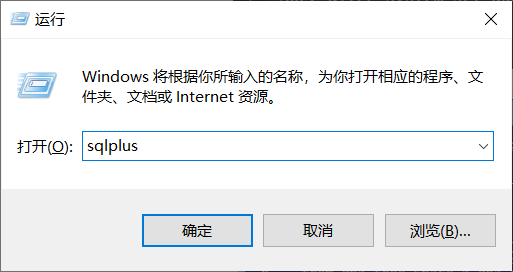

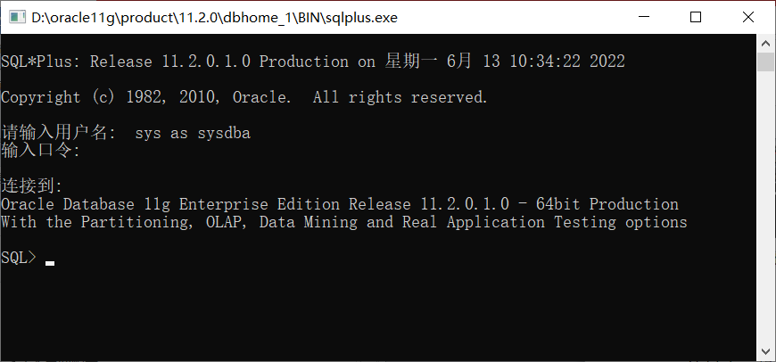

2）执行“truncate table aud\$;”截断数据

3）执行“alter system set audit_trail=NONE
scope=spfile;”修改spfile文件，关闭审计功能。

4）重启数据库：执行“shutdown
immediate;”关闭oracle例程后，执行“startup”启动数据库。

4、创建数据库

1）启动插拔数据库orclpdb

如果插拔数据库未启动，则需先启动，

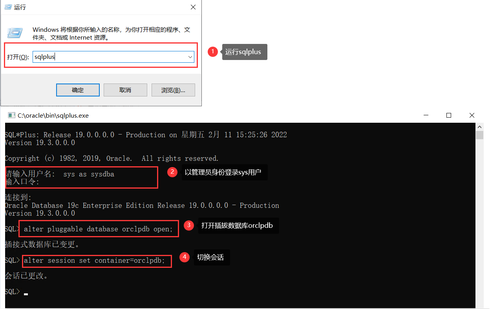

2）打开《数据库》文件夹下《createDB》文件夹，打开1、createSpaceAndUser.sql文件，按照实际情况修改其中表空间及用户的信息

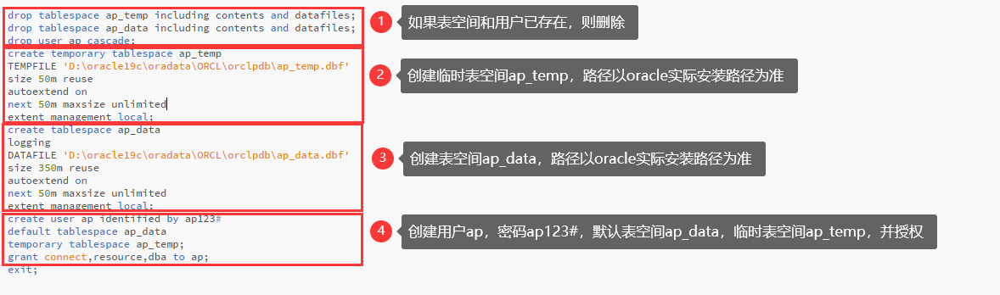

3）编辑批处理文件autorun.bat中的数据库连接信息，保存关闭后执行，执行完毕后按任意键退出，数据库创建完毕。

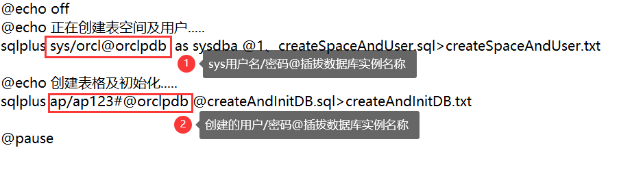

1.  管理员用户名/密码@数据库实例名

2.  自建的用户名/密码@数据库实例名

5、软件部署：打开
“1、软件”目录，将《ad.exe》程序拷贝到服务器中（路径自定义），将《ac.exe》程序拷贝到服务器中（路径自定义）；将《ap.rar》解压到tomcat安装目录\\webapps文件夹下。

6、端口开放

云服务器(如阿里云安全组规则中)需要开放端口；如果本机启动了防火墙，还需要在防火墙中将端口设为例外。

**必开放端口**，如有改变按实际情况执行：

1）16100：平台web访问端口；

2）19100：驱动程序主站端口，用于设备连接。

## <h2>1.3 系统配置</h2>

同步修改tomcat安装目录\\webapps\\ap\\WEB-INF\\config\\config.yml和tomcat安装目录\\webapps\\ap\\WEB-INF\\classes\\config\\config.yml文件，配置项如下：

1、软件访问路径配置

>   

2、数据库连接配置

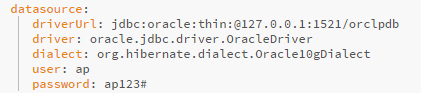

一般只需修改IP、端口、数据库实例名、用户名、密码即可。

注意：对于oracle12c及以上版本，端口后是”/”，而不是”:”，如jdbc:oracle:thin:@127.0.0.1:1521/orcl

3、AC程序路径配置，只需将IP修改为AC程序所在服务器IP即可。

4、驱动程序路径配置，只需将IP修改为驱动程序所在服务器IP即可。

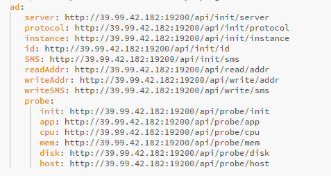

5、邮件发送账号配置

发送邮件的账号需要开启SMTP服务，并记录开通后生成的授权码或者独立密码。

account：邮箱账号；

password：邮箱授权码或独立密码；

smtpHost：邮箱服务器地址，不同服务器地址不同；

smtpPort：邮箱SMTP端口，以实际为准。

6、是否显示图标

软件界面是否显示图标(如中石油、中石化等单位logo)，false-不显示；true-显示。

7、是否打印日志

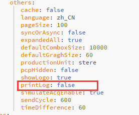

是否打印日志，false-不打印（非调试模式推荐使用）；true-打印。

8、是否发送模拟数据，用于演示

simulateAcqEnable：false-不发送；true-发送；

sendCycle：模拟数据发送周期，单位：秒；

timeDifference：模拟数据井之间发送间隔，单位：秒。

9、配置完成后，启动ad驱动程序，启动ac计算程序，启动redis，启动oracle服务，启动tomcat。全部启动后，打开浏览器，访问并登录软件，按照1.5节说明进行操作；如需修改软件名称、界面风格，请参考1.4节。

ad驱动程序有两种启动方式：

1）非日志模式：不带参数启动（非调试模式推荐使用）；

2）日志模式：ad –d启动，同目录下生成ad_log.txt日志文件。

## <h2>1.4 界面配置</h2>

先停止tomcat（如果正在运行），配置完成后再启动。如果配置未生效，需要清理浏览器缓存。

### <h3>1.4.1 登录界面</h3>

1、软件名称配置

同步修改tomcat安装目录\\webapps\\ap\\WEB-INF\\config\\config.yml和tomcat安装目录\\webapps\\ap\\WEB-INF\\classes\\config\\config.yml文件

2、软件简介配置

同步修改tomcat安装目录\\webapps\\ap\\WEB-INF\\config\\config.yml和tomcat安装目录\\webapps\\ap\\WEB-INF\\classes\\config\\config.yml文件

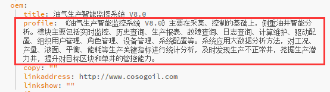

3、背景图片

替换tomcat安装目录\\webapps\\ap\\images路径下“login.jpg”图片，图片分辨率1920\*1000。修改后如未生效，需要清理浏览器缓存。

### <h3>1.4.2 主界面</h3>

1、banner背景色

背景为从左到右渐变，修改tomcat安装目录\\webapps\\ap\\styles\\banner.css文件：

修改后如未生效，需要清理浏览器缓存。

（1）底部边框

图中：2px-宽度，solid-线型为实线，\#FBC02D-边框颜色金色

（2）背景色

图中配置效果为从左到右渐变，\#006093-左侧颜色，\#0079A8-中间颜色，\#018AB9-右侧颜色。

2、图标：

（1）替换tomcat安装目录\\webapps\\ap\\images\\logo路径下“logo.jpg”图片，图片分辨率956\*921；

（2）替换tomcat安装目录\\webapps\\ap\\images\\logo路径下“favicon.ico”图片，图片分辨率16\*16。

如不显示图标，参考“1.3系统配置”内容进行配置。

3、软件名称

修改名称：见1.4.1节软件名称配置部分；

修改名称样式：修改tomcat安装目录\\webapps\\ap\\styles\\banner.css文件，修改后如未生效，需要清理浏览器缓存。

（1）字体颜色；

（2）bold-加粗，23px/50%-字体大小/行高，微软雅黑-字体；

（3）距左侧距离，如果图标大小改变，则需要修改此处；

（4）字体阴影，图中配置效果为：水平1px，竖直1px，模糊距离0px，阴影颜色白色。

4、帮助按钮样式

修改tomcat安装目录\\webapps\\ap\\styles\\banner.css文件，修改后如未生效，需要清理浏览器缓存。

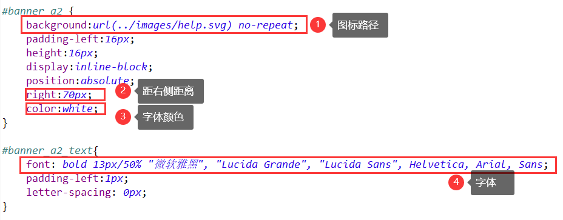

（1）图标：替换tomcat安装目录\\webapps\\ap\\images路径下“help.svg”图片；

（2）距右侧距离；

（3）字体颜色-白色；

（4）字体：bold-加粗，13px/50%-字体大小/行高，微软雅黑-字体

5、退出按钮样式

修改tomcat安装目录\\webapps\\ap\\styles\\banner.css文件，修改后如未生效，需要清理浏览器缓存。

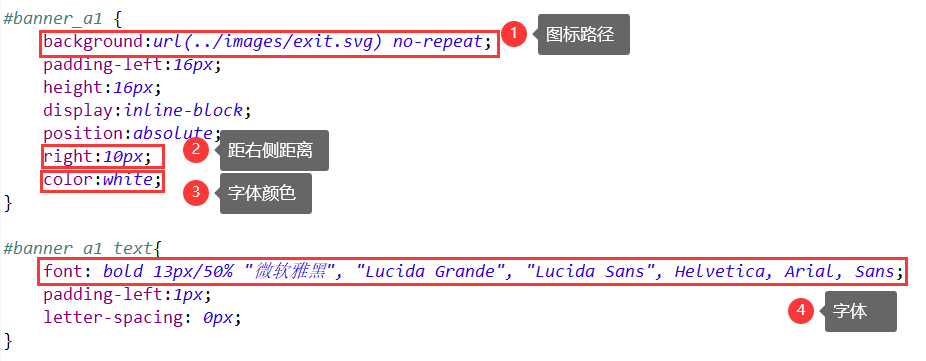

（1）图标：替换tomcat安装目录\\webapps\\ap\\images路径下“exit.svg”图片；

（2）距右侧距离；

（3）字体颜色-白色；

（4）字体：bold-加粗，13px/50%-字体大小/行高，微软雅黑-字体

## <h2>1.5 操作流程</h2>

系统部署完成后需要根据使用者实际情况进行数据配置，流程如下：

1、输入默认的软件管理员账号进入系统；

2、“组织用户”模块创建单位和用户，**详情查看2.9.1节**；

3、“角色管理”模块创建角色信息，**详情查看2.9.2节**；

4、“驱动配置”模块配置协议、单元、实例信息，**详情查看2.8节**；

5、“设备管理”模块录入设备信息，**详情查看2.10节**；

## <h2>1.6 工况说明</h2>

表1-1 功图工况表

| **序号** | **代码** | **名称**                 | **优化建议**       |
|----------|----------|--------------------------|--------------------|
| 1        | 1201     | 抽喷                     |                    |
| 2        | 1202     | 正常                     |                    |
| 3        | 1203     | 充满不足                 |                    |
| 4        | 1204     | 供液不足                 | 间抽或降低冲次     |
| 5        | 1205     | 供液极差                 | 间抽或降低冲次     |
| 6        | 1206     | 抽空                     | 间抽或降低冲次     |
| 7        | 1207     | 泵下堵                   | 洗井或加药         |
| 8        | 1208     | 气锁                     | 合理控制气体       |
| 9        | 1209     | 气影响                   | 合理控制气体       |
| 10       | 1210     | 间隙漏                   | 检泵               |
| 11       | 1211     | 油管漏                   | 油管打压试验       |
| 12       | 1212     | 游动凡尔漏失/油管漏      | 洗井、碰泵或检泵   |
| 13       | 1213     | 固定凡尔漏失             | 洗井、碰泵或检泵   |
| 14       | 1214     | 双凡尔漏失               | 洗井、碰泵或检泵   |
| 15       | 1215     | 游动凡尔失灵             | 洗井、碰泵或检泵   |
| 16       | 1216     | 固定凡尔失灵             | 洗井、碰泵或检泵   |
| 17       | 1217     | 双凡尔失灵               | 洗井、碰泵或检泵   |
| 18       | 1218     | 上死点别、碰             | 校正井口设备       |
| 19       | 1219     | 碰泵                     | 上提（增大）防冲距 |
| 20       | 1220     | 活塞/底部断脱/未入工作筒 | 下放（缩小）防冲距 |
| 21       | 1221     | 柱塞脱出工作筒           | 下放（缩小）防冲距 |
| 22       | 1222     | 杆断脱                   | 替换抽油杆         |
| 23       | 1223     | 杆（泵）卡               | 洗井或检泵         |
| 24       | 1224     | 轻微结蜡                 | 洗井或加药         |
| 25       | 1225     | 严重结蜡                 | 洗井或加药         |
| 26       | 1226     | 轻微出砂                 | 防砂               |
| 27       | 1227     | 严重出砂                 | 防砂               |
| 28       | 1230     | 惯性载荷大               | 降低冲次           |
| 29       | 1231     | 应力超标                 | 优化抽油杆柱组合   |
| 30       | 1232     | 采集异常                 | 检查采集仪表       |
| 31       | 1302     | 停抽                     |                    |

## <h1>第2章 应用介绍</h1>

浏览器要求：建议谷歌浏览器、360浏览器极速模式、IE9以上版本。

## <h2>2.1 页面布局</h2>

1、banner区：包括修改密码、退出、帮助及全屏按钮；

2、功能导航区：系统各主功能模块；

3、组织导航区：用户组织结构；

4、模块详细功能。

通过点击界面中缝位置的图标或可实现界面伸缩。

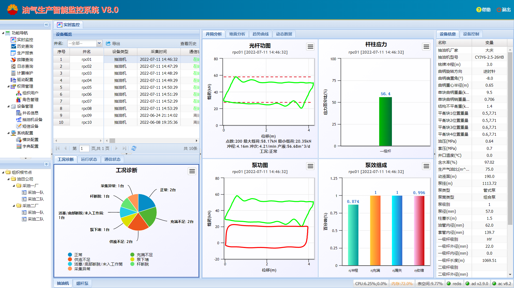

图2-1 界面概览

## <h2>2.2 实时监控</h2>

根据设备数据进行实时监控，**有新数据时，界面自动刷新。**

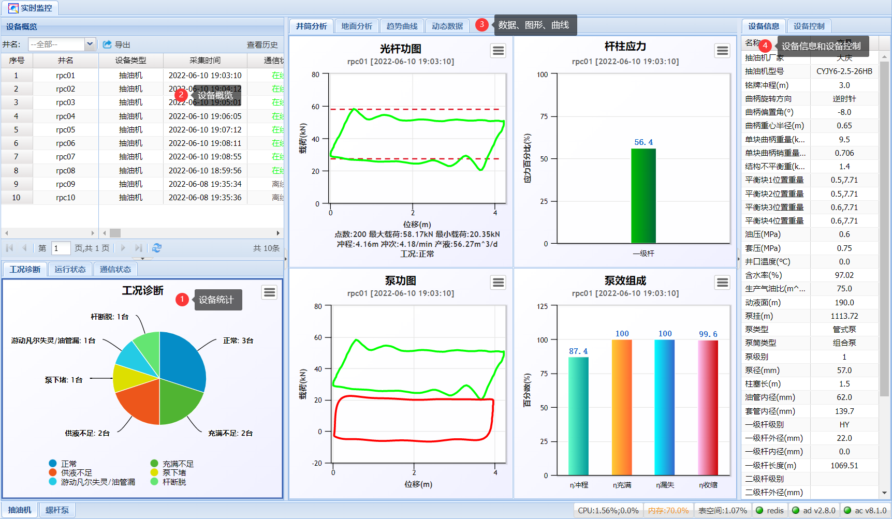

图2-2 实时监控

### <h3>2.2.1 设备统计</h3>

抽油机设备统计包括工况诊断统计、运行状态统计和通信状态统计；

螺杆抽油机设备统计包括运行状态统计和通信状态统计。

点击饼图相应部分可对设备进行筛选。

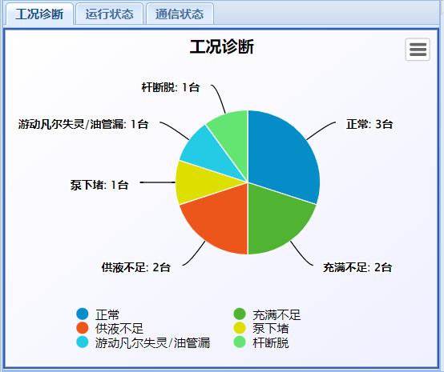

图2-3 实时监控-工况诊断统计饼图

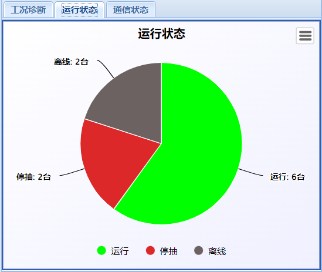

图2-4 实时监控-运行状态统计饼图

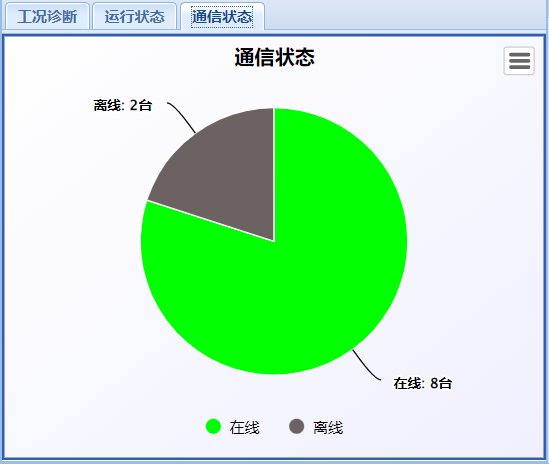

图2-5 实时监控-通信状态统计饼图

### <h3>2.2.2 设备概览</h3>

显示设备列表及最新采集、计算数据，动态实时刷新，并可将数据导出。概览列表中显示的内容可在数据字典模块进行配置，详见2.9.2字典配置。

切换历史数据：选中设备所在行，点击“查看历史”按钮（或者双击设备所在行），跳转到历史查询模块并显示该设备历史数据。

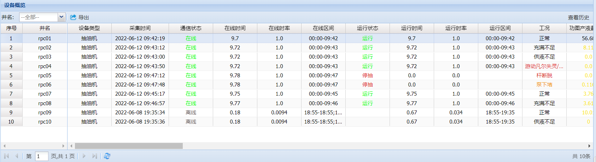

图2-6 实时监控-设备概览

### <h3>2.2.3 井筒分析</h3>

**（1）光杆功图**

1.  功图采集时间：例如2022-06-12 10:02:22

2.  上理论载荷线：上理论载荷=活塞以上液柱载荷+抽油杆在液柱中的载荷

3.  下理论载荷线：下理论载荷=抽油杆在液柱中的载荷

4.  最大载荷：功图最大载荷

5.  最小载荷：功图最小载荷

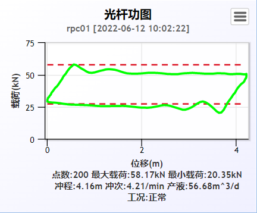

图2-7 地面功图

**（2）泵功图**

从上至下依次为：

1.  地面功图

2.  二级杆顶端功图

3.  三级杆顶端功图

4.  泵功图

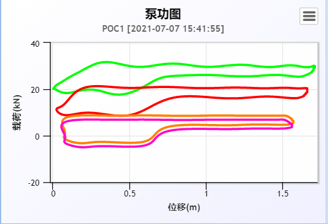

图2-8 泵功图

**（3）杆柱应力**

根据杆柱组合，分析各级杆柱的受力情况，判断杆柱组合是否合理。

1.  一级杆顶端应力百分比

2.  二级杆顶端应力百分比

3.  三级杆顶端应力百分比

4.  

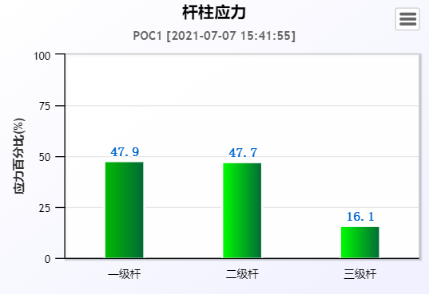

图2-9 杆柱应力

**（4）泵效组成**

泵的实际排量与泵的理论排量之比的百分数称为泵效。

—冲程损失对泵效的影响；

—泵的充满程度，功图计算分析求得；

—液体的漏失系数，考虑泵工作时液体漏失的影响；

—体积变化的影响，通过计算泵条件下的液体体积系数求得；

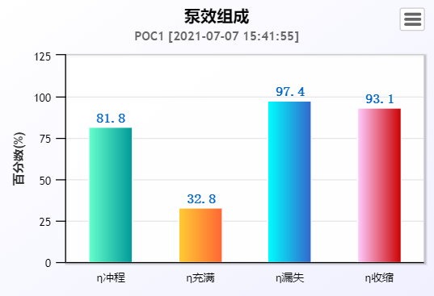

图2-10 泵效组成

### <h3>2.2.4 地面分析</h3>

**（1）电功图**

电功图是电的有功功率图，功率平衡度计算：

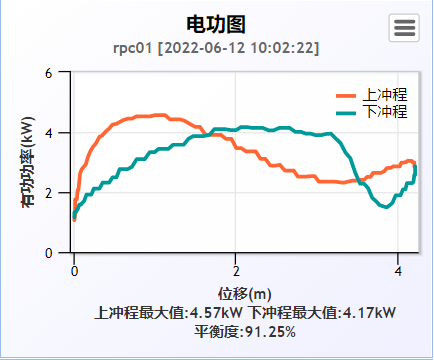

图2-11 电功图

**（2）电流图**

电流平衡度计算：

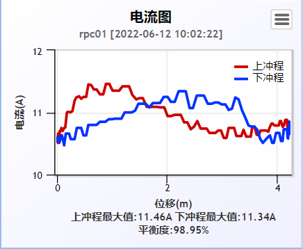

图2-12 电流图

**（3）目前扭矩曲线**

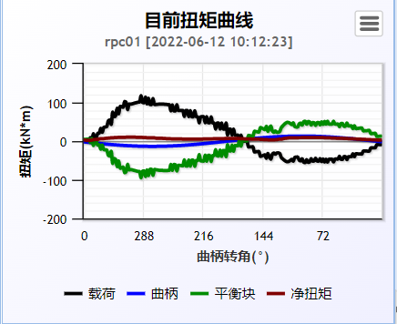

图2-13 目前扭矩曲线

**（5）预期扭矩曲线**

根据曲柄平衡移动距离推导出的调整后的预期扭矩曲线。

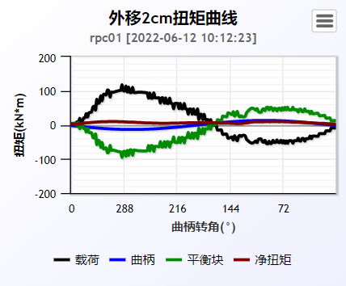

图2-14 预期扭矩曲线

### <h3>2.2.5 趋势曲线</h3>

趋势曲线，动态实时刷新。显示哪些数据曲线可在驱动配置-单元配置-显示单元中配置。趋势曲线只能查看当天数据，可点击时间区域显示对应曲线。

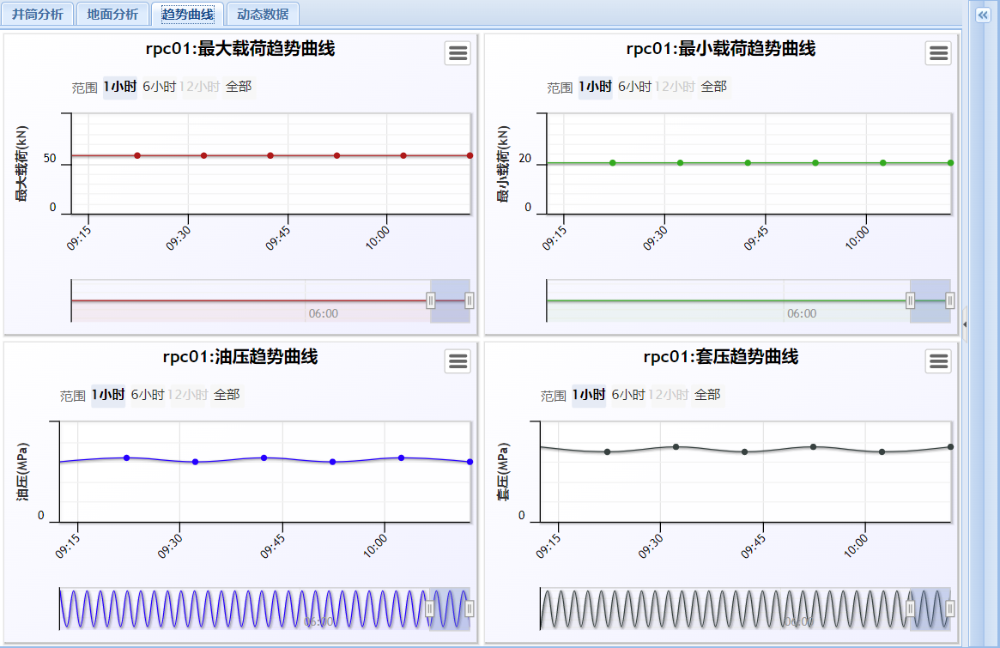

图2-15 实时监控-趋势曲线

### <h3>2.2.6 动态数据</h3>

显示概览表中所选设备的动态数据及报警，动态实时刷新。显示哪些数据可在驱动配置-单元配置-显示单元中配置。

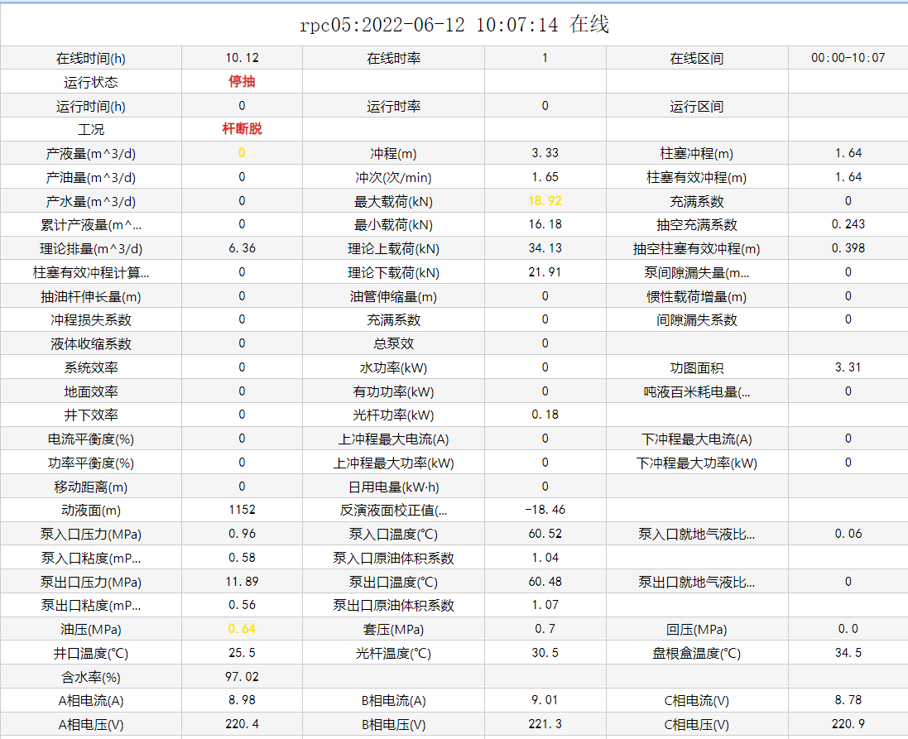

图2-16 实时监控-动态数据

### <h3>2.2.5 设备信息</h3>

显示设备参数信息。

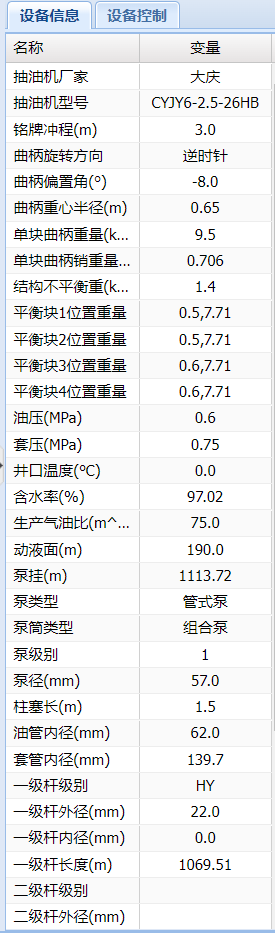

图2-17 实时监控-设备信息

### <h3>2.2.6 设备控制</h3>

根据设备配置的采控数据，动态显示控制项，点击按钮进行相应的控制。

**注意：当前登录用户拥有控制权限且目标设备在线时，才可进行控制**。

图2-18 实时监控-设备控制

### <h3>2.2.7 资源监测</h3>

实时监测服务器的CPU、内存使用情况、数据库表空间使用率(当使用率达到100%时，将影响数据库正常使用，需扩展表空间文件)、redis运行状态、驱动程序运行状态和版本信息以及计算程序运行状态和版本信息，点击可查看历史曲线。

图2-19 实时监控-资源监测

## <h2>2.3 历史查询</h2>

查询设备历史数据

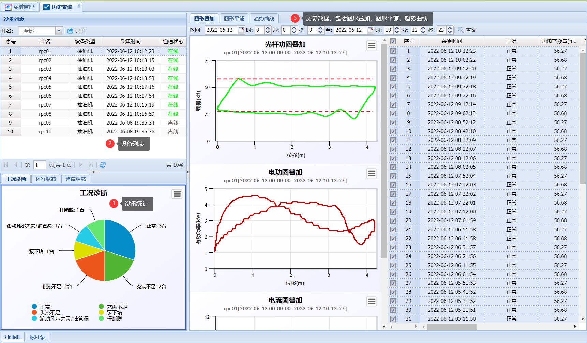

图2-20 历史查询

### <h3>2.3.1 设备统计</h3>

抽油机设备统计包括工况诊断统计、运行状态统计和通信状态统计；

螺杆抽油机设备统计包括运行状态统计和通信状态统计。

点击饼图相应部分可对设备进行筛选。

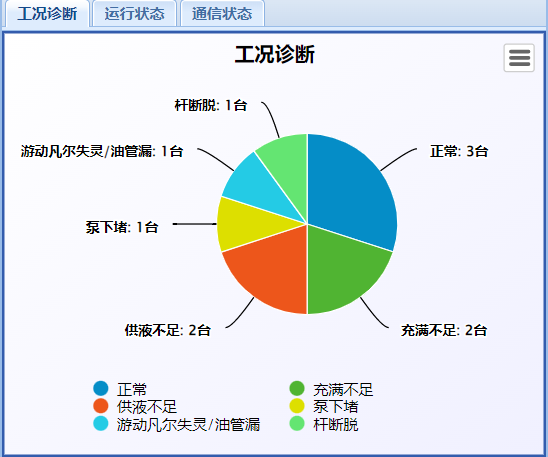

图2-21 历史查询-工况诊断统计饼图

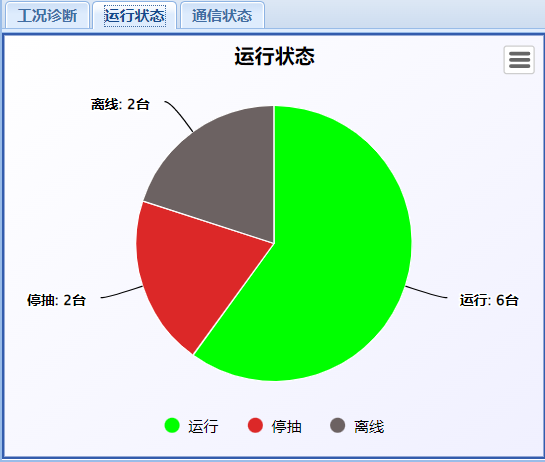

图2-22历史查询-运行状态统计饼图

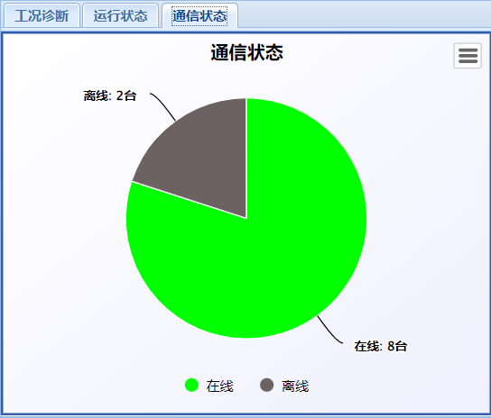

图2-23历史查询-通信状态统计饼图

### <h3>2.3.2 设备列表</h3>

显示设备列表以及当前通信状态和最新数据的采集时间。

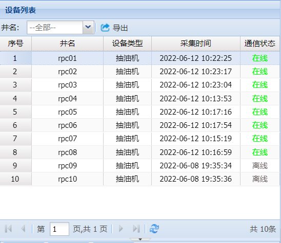

图2-24 历史查询-设备列表

### <h3>2.3.3 图形叠加</h3>

显示设备列表中所选设备某时间段内地面功图、电功图以及电流图的叠加图。

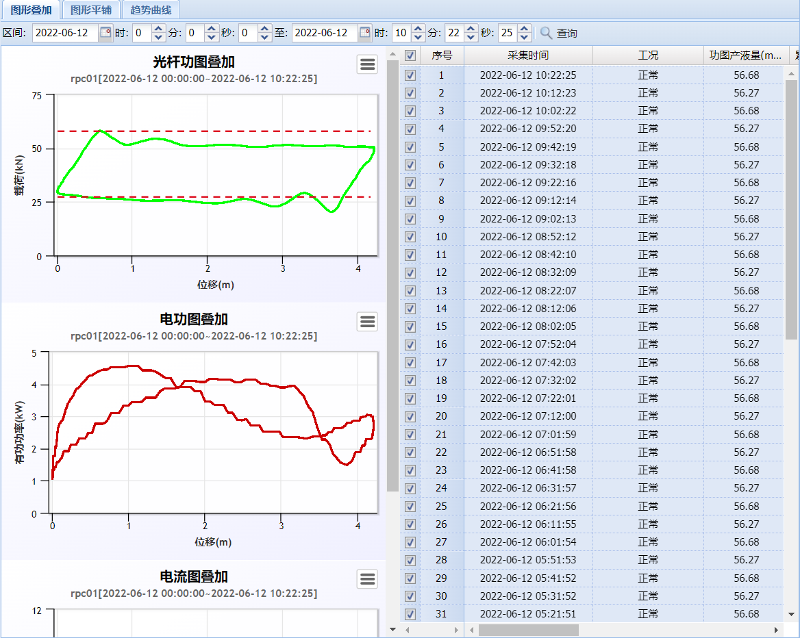

图2-25 历史查询-图形叠加

### <h3>2.3.4 图形平铺</h3>

显示设备列表中所选设备某时间段内地面功图，以平铺的方式展现。

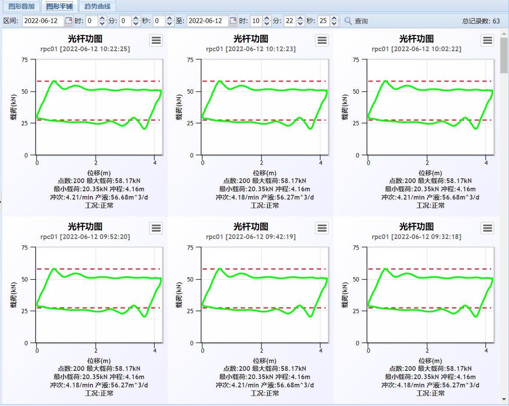

图2-26 历史查询-图形平铺

### <h3>2.3.5 趋势曲线</h3>

1、历史趋势曲线

显示设备列表中所选设备的历史趋势曲线，当历史数据记录数大于500时，显示数据抽稀后的曲线。显示哪些数据曲线可在驱动配置-单元配置-显示单元中配置。

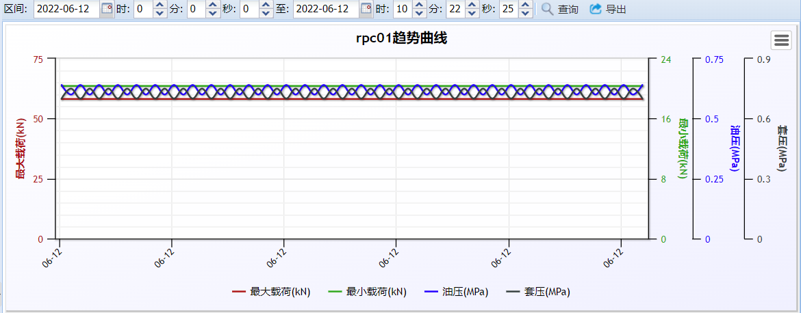

图2-27 历史查询-趋势曲线

点击曲线上的菜单按钮，选择“图形设置”，可设置每条曲线Y轴坐标最大、最小值。

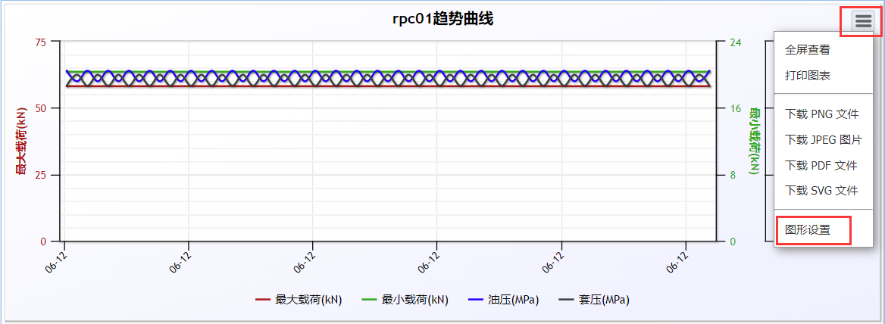

图2-28 历史查询-历史曲线设置1

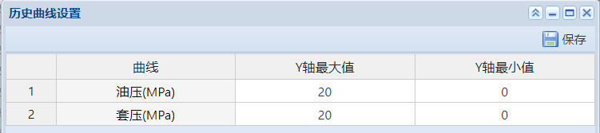

图2-29 历史查询-历史曲线设置2

### <h3>2.3.6 历史数据列表</h3>

显示设备列表所选设备的历史数据，表中为概览数据的历史，概览列表中显示的内容可在数据字典模块进行配置，详见2.9.2字典配置。点击详细查看详细数据。

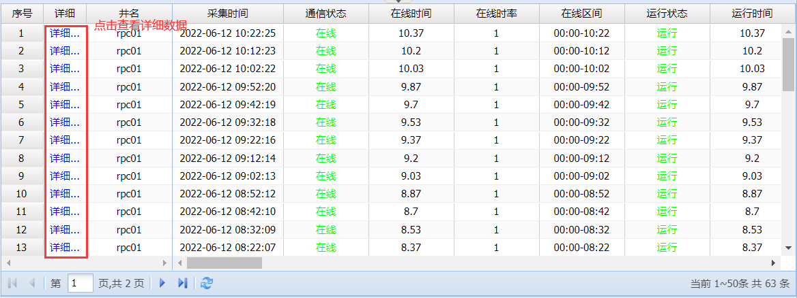

图2-30 历史查询-概览数据历史

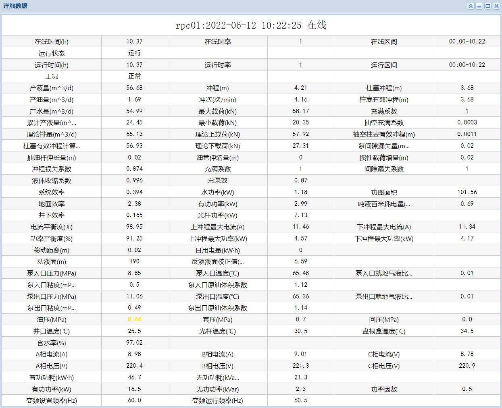

图2-31 历史查询-详细数据

## <h2>2.4 生产报表</h2>

查看设备日报表

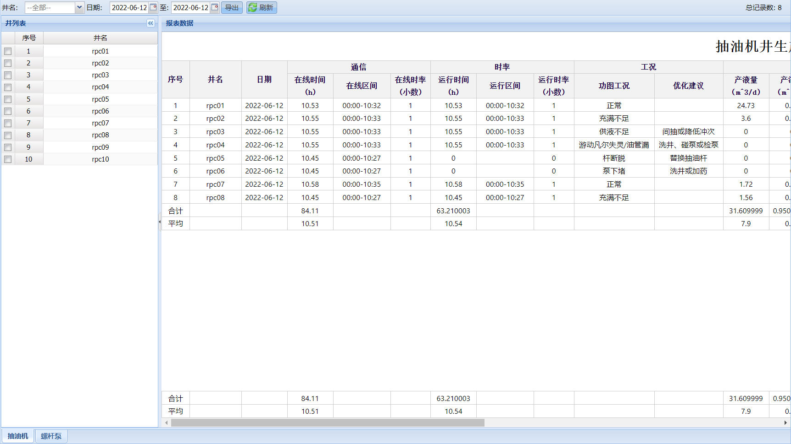

图2-32 生产报表

## <h2>2.5故障查询</h2>

查询设备报警信息，包括工况诊断报警、运行状态报警、通信状态报警、数据量报警、枚举量报警、开关量报警。

### <h3>2.5.1 工况诊断报警</h3>

查询设备工况报警数据。

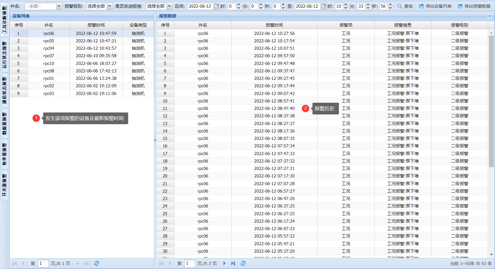

图2-33 故障查询-工况诊断报警

### <h3>2.5.2 运行状态报警</h3>

查询设备运行状态报警数据。

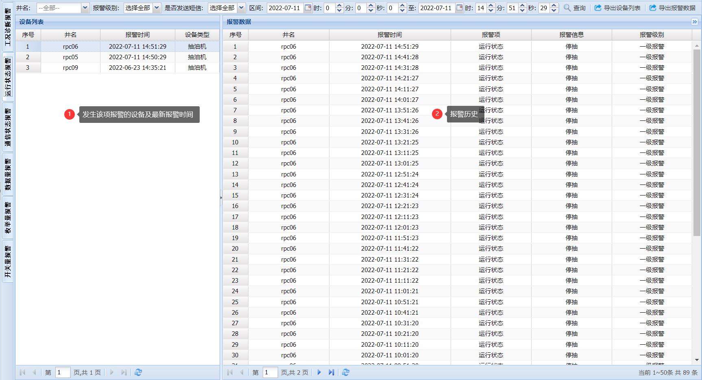

图2-34 故障查询-运行状态报警

### <h3>2.5.3 通信状态报警</h3>

查询设备上线、离线报警数据。

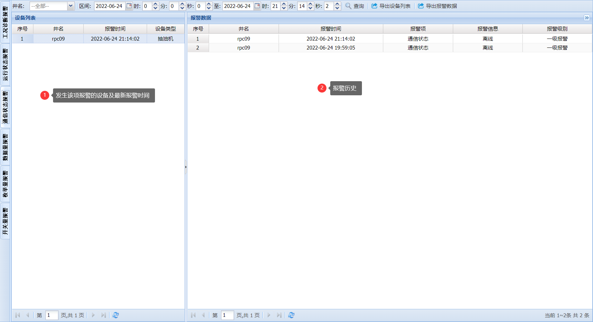

图2-35 故障查询-通信状态报警

### <h3>2.5.4 数据量报警</h3>

查询设备数据量数据的报警信息。

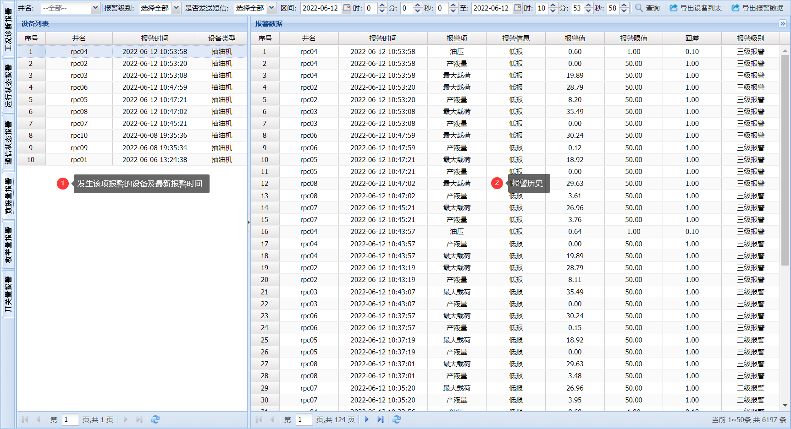

图2-36 故障查询-数据量报警

### <h3>2.5.5 枚举量报警</h3>

查询设备枚举量数据的报警信息。

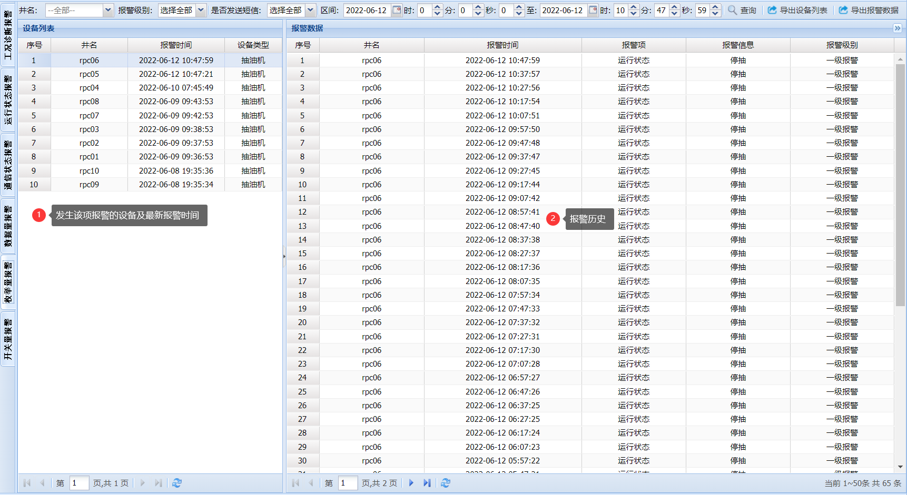

图2-37 故障查询-枚举量报警

### <h3>2.5.6 开关量报警</h3>

查询设备开关量数据的报警信息。

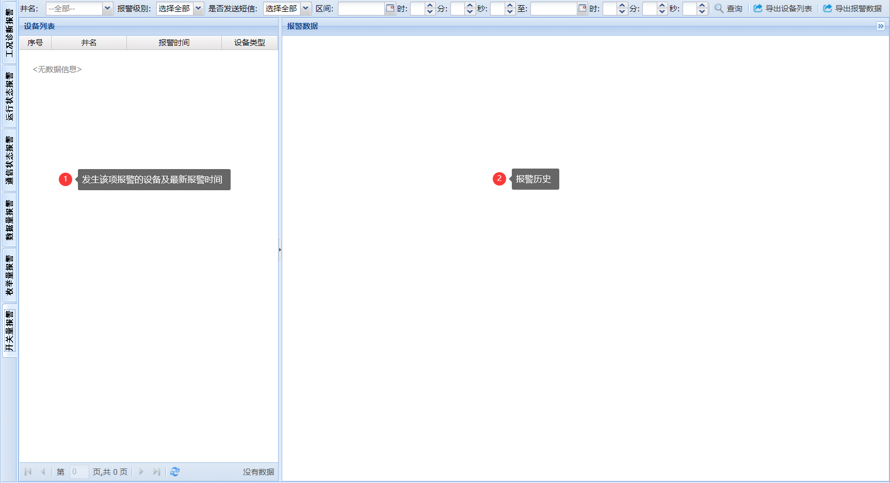

图2-38 故障查询-开关量报警

## <h2>2.6 日志查询</h2>

日志数据查询，包括设备日志和系统日志。

### <h3>2.6.1 设备日志</h3>

查询设备操作日志，如设备的添加、修改、删除和控制。

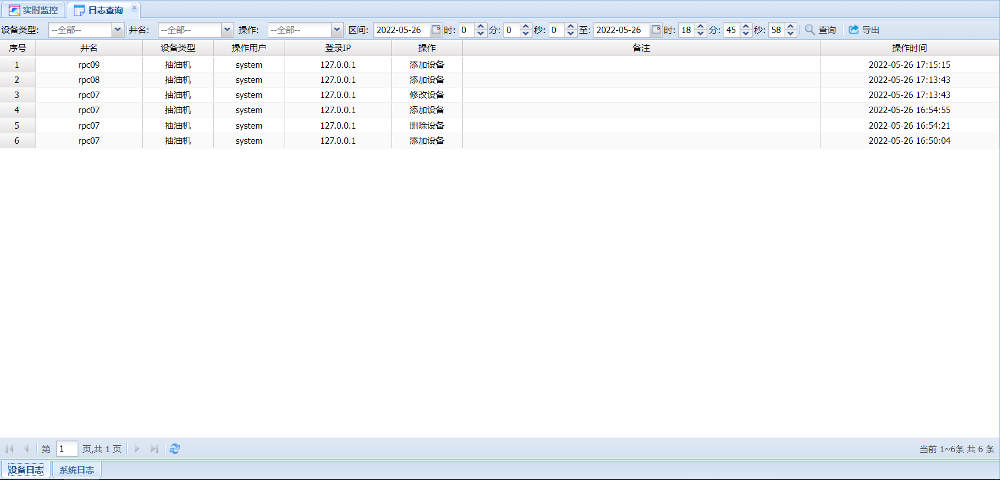

图2-39 日志查询-设备日志

### <h3>2.6.2 系统日志</h3>

查询用户登录时间、登录IP等。

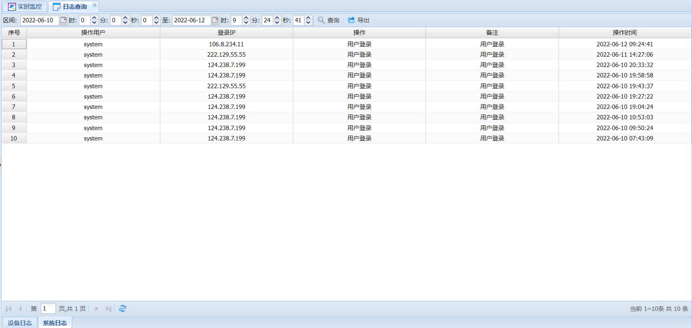

图2-40 日志查询-系统日志

## <h2>2.7 计算维护</h2>

使用场景：

计算维护模块主要应用场景包括：

>   1、针对系统部署初期或现场设备安装初期，各井的生产数据并未收集或收集的不完整，在进行功图诊断及产量计算时采用了测试数据，待后续生产数据收集完整后，需要对历史数据进行重新计算。

>   2、生产数据收集的部分数据有误，更正后需要重新计算。

>   3、在使用过程中，现场作业后并未及时更新生产数据。

>   4、其他需要对历史数据或者汇总数据进行重新计算的情况；

### <h3>2.7.1 单条记录维护</h3>

使用方法

对历史结果进行重新计算有两种方法，根据实际情况选择较为便捷的方法：

1、修改数据计算

选择目标井，找到需要修改的某条记录或某个时间段的多条记录，修改完生产数据后，点击“修改数据计算”按钮进行重新计算。

例如：修改rpc01井井，采集时间为2022-07-11
14:56:32的的记录原油密度数据并重新计算。

操作：修改表中参数，点击“修改数据计算”按钮。

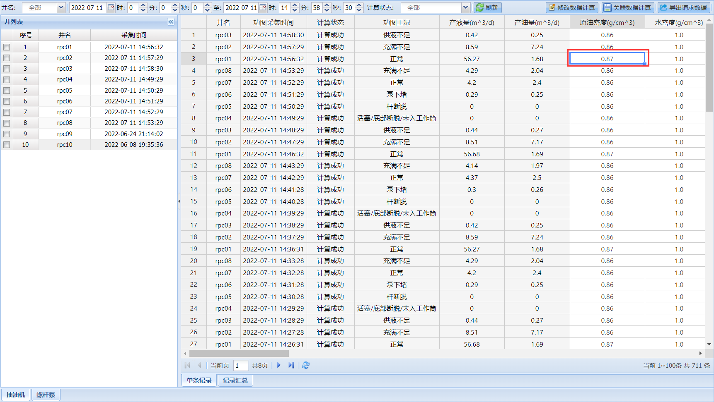

图2-41 修改数据计算

2、关联数据计算

利用生产数据表中的最新生产数据对某口井或所有井某个时间段内的所有历史结果进行重新计算。

（1）单井关联数据计算

例如：在“井名信息”模块中，修改了rpc01井的生产数据，并将2022-07-01
00:00:00至2022-07-11 14:56:30区间内的历史数据应用改后的生产数据，重新计算。

操作：设备列表中选择rpc01（如果未选中某口井，将会重新计算所选组织下所有井在某时间段内的数据），时间范围2022-07-01
00:00:00至2022-07-11
14:56:30，点击“关联数据计算”。弹出操作确认对话框，确认无误后点击“是”。这时，rpc01井2022-07-01
00:00:00至2022-07-11 14:56:30的所有历史数据将按最新的生产数据进行重新计算。

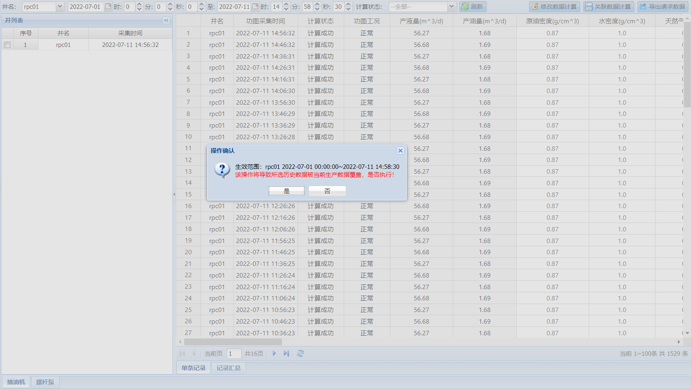

图2-42 单井关联数据计算

### <h3>2.7.2 汇总记录维护</h3>

重新计算选中的汇总记录。

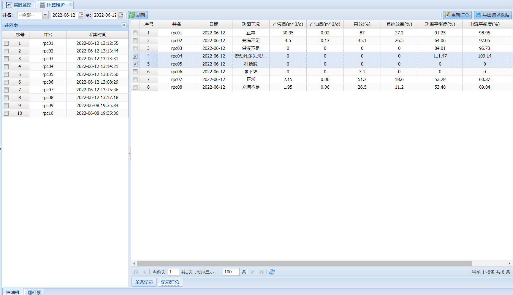

图2-43 计算维护-汇总记录

## <h2>2.8驱动配置</h2>

包括协议配置、单元配置、实例配置。

### <h3>2.8.1 协议配置</h3>

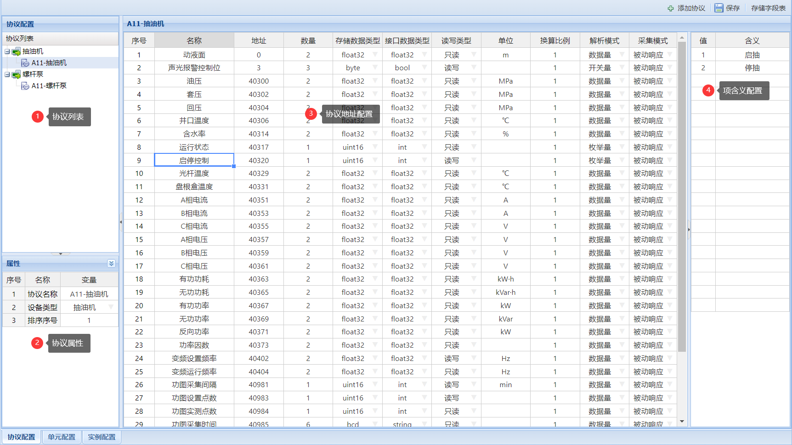

图2-44 协议配置

#### <h4>2.8.1.1 协议列表</h4>

第一层节点：协议所属设备类型，抽油机设备或螺杆泵；

第二层节点：协议；

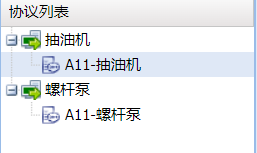

图2-45 协议列表

#### <h4>2.8.1.2 协议属性</h4>

树形列表中所选协议的属性，可在此处进行查看和修改。

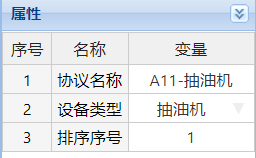

图2-46协议属性窗口

#### <h4>2.8.1.3 协议地址配置</h4>

协议下具体地址配置，在此处进行添加（右键插入）、修改（单元格直接编辑）、删除（右键删除）。修改后点击保存按钮。（支持从excel中粘贴）

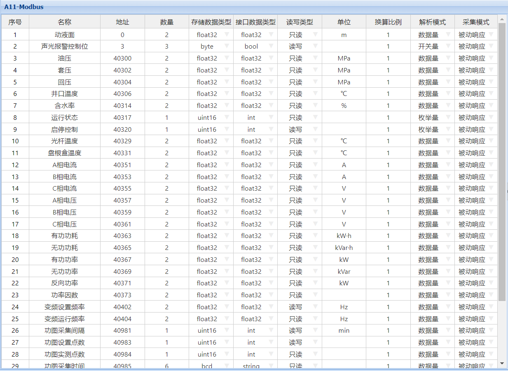

图2-47 协议地址配置

名称：项名称；

地址：项起始地址，数组地址、modbus协议寄存器地址；

数量：

（1）主动上传协议：数量指的是存储数据类型的数量，如1个uint16，1个float32（开关量位数组例外，数量填写16，指16位，如保护开关）

（2）被动响应modbus协议：数量指的是寄存器或者线圈数量；

存储数据类型：设备中存储该项数据的数据类型，包括：byte、int16（有符号16位整型）、uint16（无符号16位整型）、float32（32位浮点）、bcd（bcd码，时间一般配置为该类型）；

接口数据类型：上位机要解析成的数据类型(界面显示的数据)，包括bool（布尔型）、int（整型）、float32（32位浮点）、float64（64位浮点）、string（字符串），位数组和开关量接口数据类型固定选择bool型；

单位：上位机解析后的单位（和界面显示一致）；

换算比例：存储数据\*换算比例=接口数据（解析数据时，存储数据解析后乘以换算比例，得到界面显示的接口数据；控制设备时，界面输入的控制值为接口数据，除以换算比例，为最终写入到设备中的存储数据）；

解析模式：数据量、枚举量、开关量；

采集模式：主动上传（设备主动上传）、被动相应（设备被动等待上位机读写）。

#### <h4>2.8.1.4 项含义配置</h4>

枚举量：如运行状态值对应的含义配置

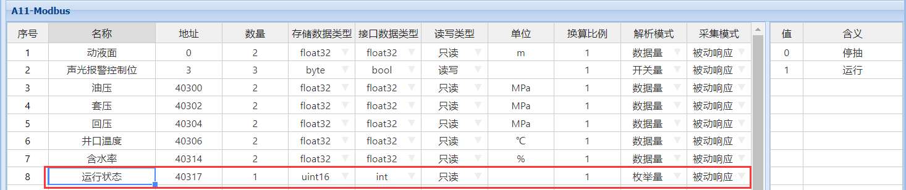

图2-48 枚举量含义配置

开关量：如保护开关位数组，位所对应的开关状态

图2-49开关量位含义配置

数据量：如井口温度，将值-50设置为无效数据N/A

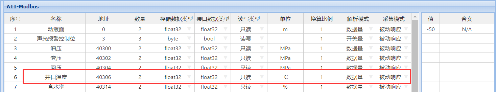

图2-50数据量显示转换配置

#### <h4>2.8.1.5 协议添加及删除</h4>

1、协议添加

点击“添加协议”按钮，添加协议，同设备类型下不能创建同名协议。

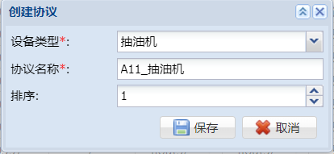

图2-51协议添加

协议添加后，再配置协议的地址信息。

2、协议删除

在协议列表中，选中要删除的协议，右键→删除协议。

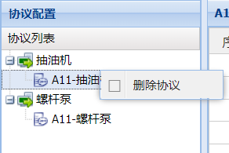

图2-52协议删除

#### <h4>2.8.1.6 存储字段表</h4>

点击“存储字段表”按钮，查看抽油机设备和螺杆泵设备根据协议自动生成的数据库字段表，相应项的内容存储到设备采集数据表相应的字段中。以及某些特殊含义的字段，需要设置计算字段（内容固定，如运行状态对应RunStatus）。

存储模式分为以地址为准和以名称为准，详见1.3系统配置中数据保存模式配置。

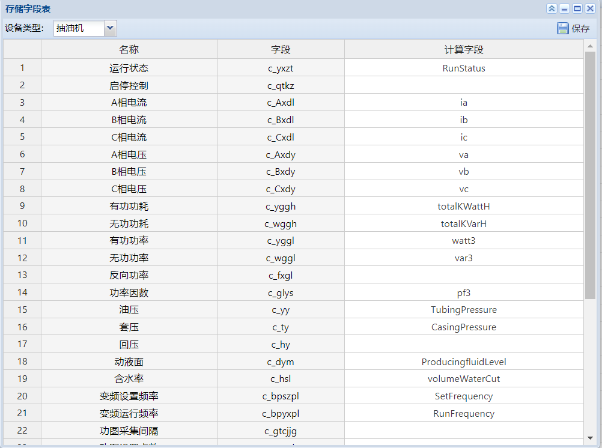

图2-53存储字段表

### <h3>2.8.2 单元配置-采控单元</h3>

在协议下面创建采控单元，每个采控单元下面可以创建一个采集组和一个控制组，并勾选采集组和控制组包含的项。

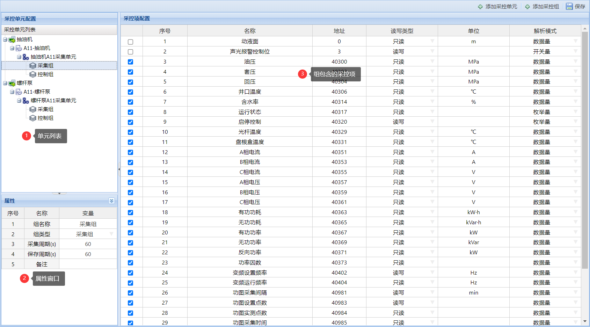

图2-54采控单元

#### <h4>2.8.2.1 单元列表</h4>

第一层节点：设备类型，抽油机设备或螺杆泵设备

第二层节点：协议；

第三层节点：采控单元；

第四层节点：采集组或者控制组；

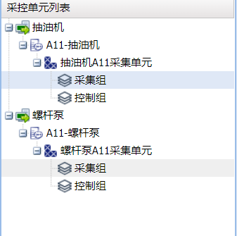

图2-55采控单元列表

#### <h4>2.8.2.2 属性</h4>

1、采控单元属性

树形列表中所选采控单元的属性，可在此处进行查看和修改。

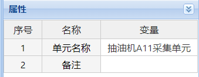

图2-56采控单元属性窗口

2、采集组属性

树形列表中所选采集组的属性，可在此处进行查看和修改。

采集周期：针对被动相应数据生效，上位机采集周期；

保存周期：历史数据保存周期；

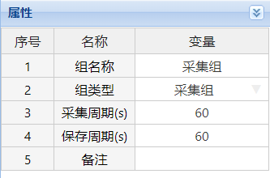

图2-57采集组属性窗口

3、控制组属性

树形列表中所选控制组的属性，可在此处进行查看和修改。

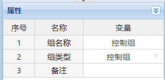

图2-58控制组属性窗口

#### <h4>2.8.2.3 组包含项配置</h4>

1、采集组包含的采集项配置

左侧树形列表中选择要配置的采集组，在采控项配置列表中勾选包含的采集项；

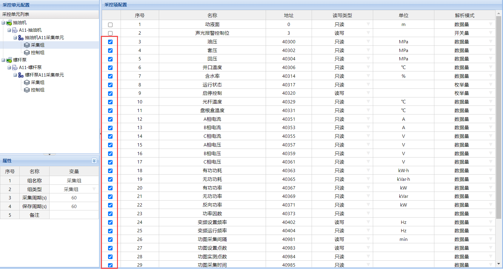

图2-59采集组包含采集项配置

2、控制组包含的控制项项配置

左侧树形列表中选择要配置的控制组，在采控项配置列表中勾选包含的控制项（读写类型为只写或者读写）；

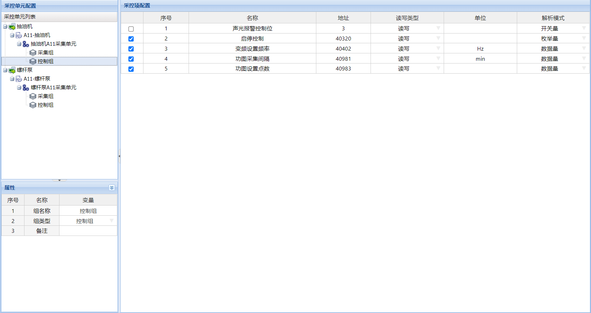

图2-60控制组包含控制项配置

#### <h4>2.8.2.4 创建和删除采控单元</h4>

1、创建采控单元

点击“添加采控单元”按钮，进行采集单元的创建。

协议名称：在下拉框中选择所属协议；

单元名称：单元名称，同一协议下不能创建同名的采集单元；

单元描述：单元描述；

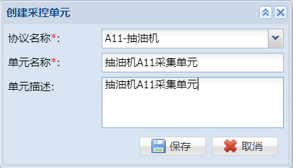

图2-61创建采控单元

2、删除采控单元

在左侧树形菜单中选中要删除的单元，右键→删除采控单元。

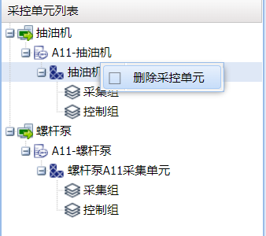

图2-62删除采控单元

#### <h4>2.8.2.5 创建和删除采控组</h4>

1、创建采控组

点击“添加采控组”按钮，进行采集组的创建。

协议名称：在下拉框中选择所属协议；

单元名称：在下拉框中选择所属单元；

组名称：组名称，同一采控单元下不能创建同名采集组；

组类型：采集组或者控制组

采集周期：采集组填写

保存周期：采集组填写

组描述：组描述。

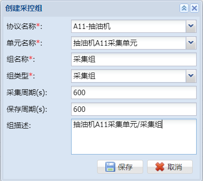

图2-63创建采控组

2、删除采控组

在左侧树形菜单中选中要删除的组，右键→删除采控组。

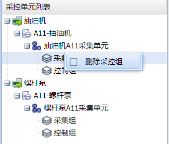

图2-64删除采控组

### <h3>2.8.3 单元配置-显示单元</h3>

在协议下面创建显示单元，并设置单元下包含的项及曲线。

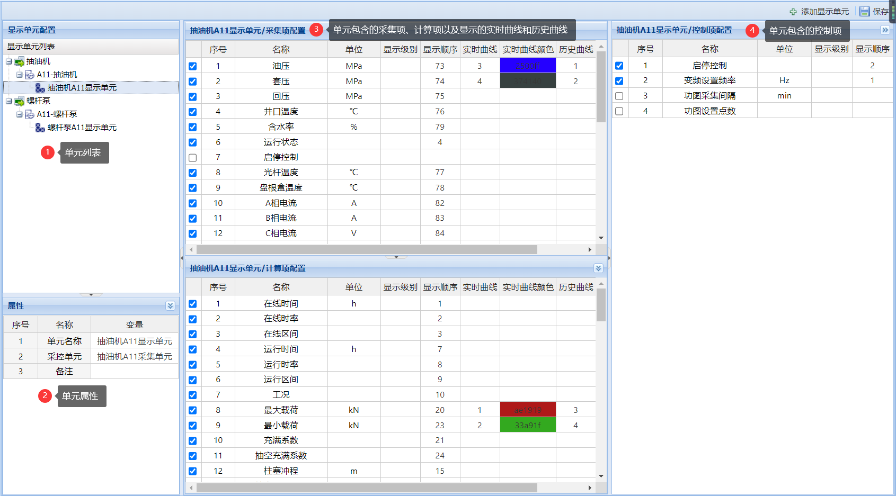

图2-65显示单元

#### <h4>2.8.3.1 单元列表</h4>

第一层节点：设备类型，抽油机设备或螺杆泵设备

第二层节点：协议；

第三层节点：显示单元；

#### <h4>2.8.3.2 单元属性</h4>

树形列表中所选显示单元的属性，可在此处进行查看和修改。

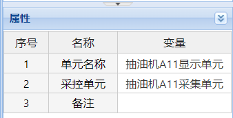

图2-66显示单元属性窗口

#### <h4>2.8.3.3 单元包含项配置</h4>

1、采集项和计算项

左侧树形列表中选择要配置的显示单元，在采集项和计算项配置列表中勾选包含的显示项。

图2-67显示单元包含采集项和计算项配置

显示级别：采集项显示级别，用户只能查看显示级别小于自身数据显示级别的数据（见角色管理和用户管理，数字越大代表等级越小）；

显示顺序：对应实时监控模块中实时数据表和历史查询模块中详细数据表中项的显示顺序（左到右、上到下顺序），未设置顺序的项将放在最后面显示；

实时曲线：实时曲线显示顺序，未设置则不显示曲线；

实时曲线颜色：双击单元格，选择曲线颜色，未设置按默认颜色显示；

历史曲线：历史曲线显示顺序，未设置则不显示曲线；

历史曲线颜色：双击单元格，选择曲线颜色，未设置按默认颜色显示；

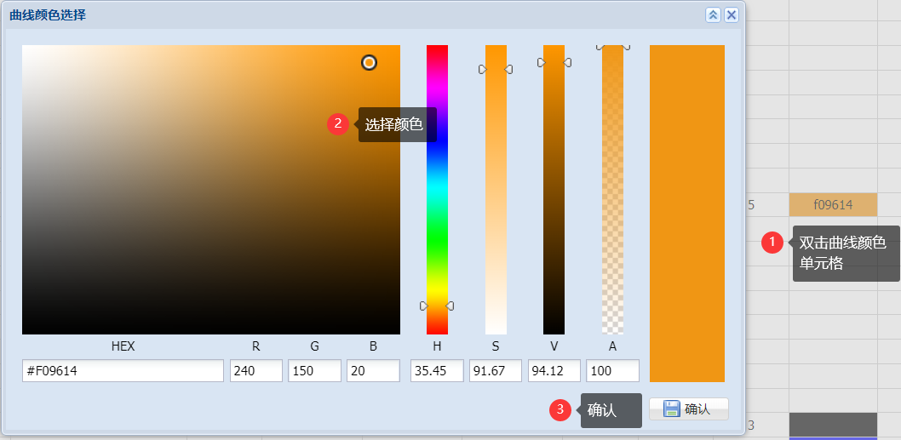

图2-68曲线颜色配置

2、控制项

左侧树形列表中选择要配置的显示单元，在控制项配置列表中勾选包含的显示项。

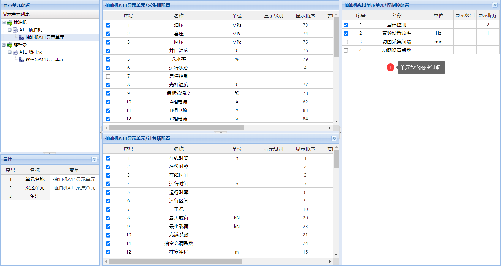

图2-69开关量报警项配置

显示级别：采集项显示级别，用户只能查看显示级别小于自身数据显示级别的数据（见角色管理和用户管理，数字越大代表等级越小）；

显示顺序：对应实时监控模块中设备控制中的控制项显示顺序。

### <h3>2.8.4 单元配置-报警单元</h3>

在协议下面创建报警单元，并设置单元下包含的报警项及报警配置。

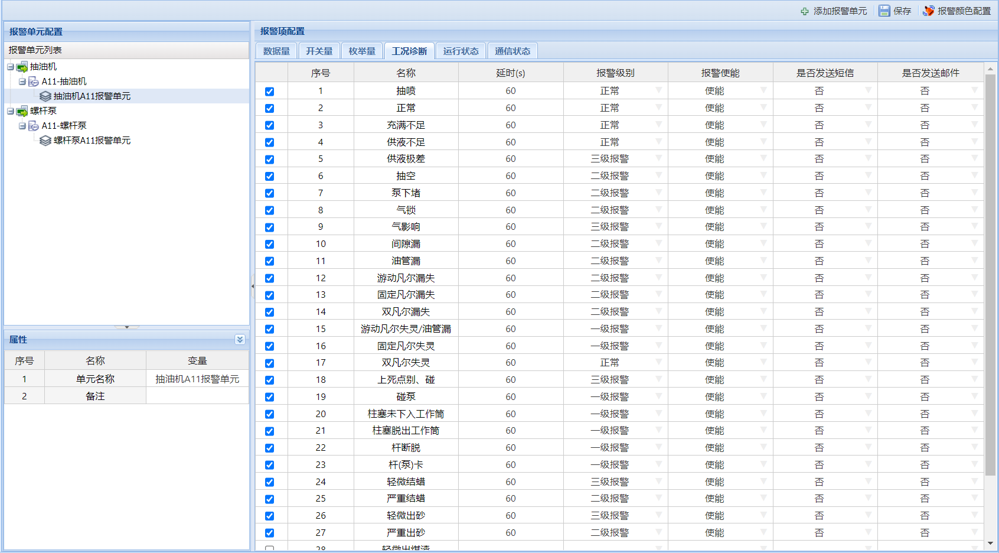

图2-70报警单元

#### <h4>2.8.4.1 单元列表</h4>

第一层节点：设备类型，抽油机设备或螺杆泵设备

第二层节点：协议；

第三层节点：报警单元；

#### <h4>2.8.4.2 单元属性</h4>

树形列表中所选报警单元的属性，可在此处进行查看和修改。

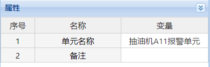

图2-71报警单元属性窗口

#### <h4>2.8.4.3 单元包含报警项配置</h4>

左侧树形列表中选择要配置的报警，分别配置数据量、开关量、枚举量、工况诊断、运行状态、通信状态报警项；

1、数据量报警项配置

勾选单元包含的数据量报警项，并设置

上限：报警上限；

下限：报警下限；

回差：值大于上限和回差的和或者小于下限和回差的差值则报警；

延时：延时时间内不重复报警和推送；

报警级别：正常、一级报警、二级报警、三级报警（一级为最紧急严重）；

报警使能：使能或者失效（失效则一律不报警）；

是否发送短信：报警发生时是否向用户发送短信（建议一级报警项设为是，其他为否，避免频繁发送）；

是否发送邮件：报警发生时是否向用户发送邮件（建议一级报警项设为是，其他为否，避免频繁发送）；

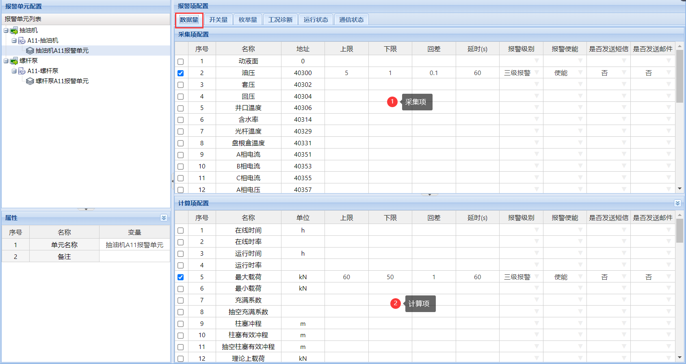

图2-72数据量报警项配置

2、开关量报警项配置

选中要设置报警的开关量数据，并设置

触发状态：开或者关触发报警；

延时：延时时间内不重复报警和推送；

报警级别：正常、一级报警、二级报警、三级报警（一级为最紧急严重）；

报警使能：使能或者失效（失效则一律不报警）；

是否发送短信：报警发生时是否向用户发送短信（建议一级报警项设为是，其他为否，避免频繁发送）；

是否发送右键：报警发生时是否向用户发送邮件（建议一级报警项设为是，其他为否，避免频繁发送）；

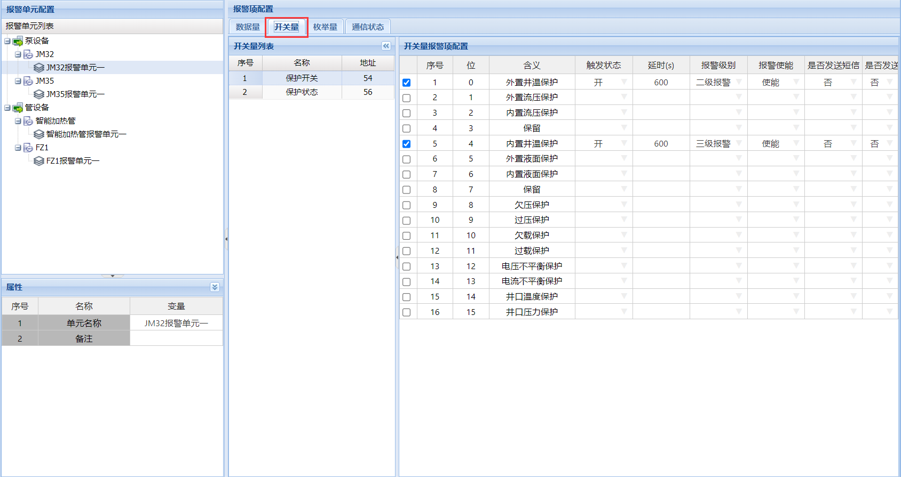

图2-73开关量报警项配置

3、枚举量报警项配置

勾选单元包含的枚举量报警项，并设置

延时：延时时间内不重复报警和推送；

报警级别：正常、一级报警、二级报警、三级报警（一级为最紧急严重）；

报警使能：使能或者失效（失效则一律不报警）；

是否发送短信：报警发生时是否向用户发送短信（建议一级报警项设为是，其他为否，避免频繁发送）；

是否发送右键：报警发生时是否向用户发送邮件（建议一级报警项设为是，其他为否，避免频繁发送）；

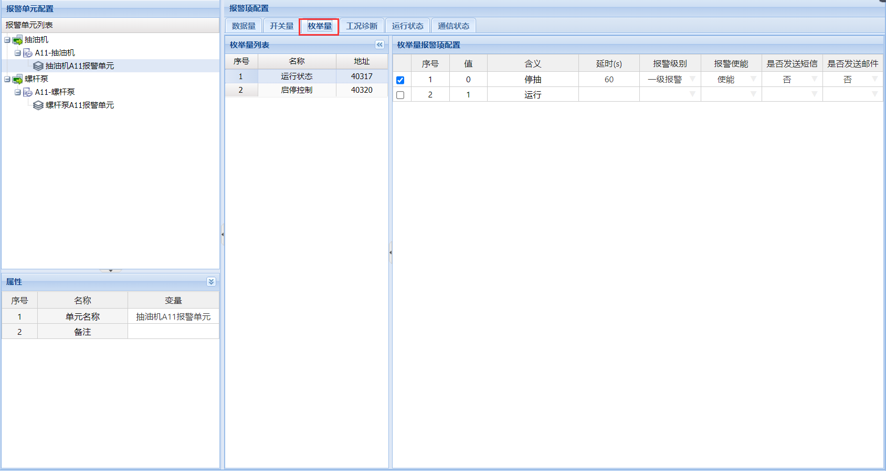

图2-74枚举量报警项配置

4、工况诊断报警项配置

勾选单元包含的工况诊断报警项，并设置

延时：延时时间内不重复报警和推送；

报警级别：正常、一级报警、二级报警、三级报警（一级为最紧急严重）；

报警使能：使能或者失效（失效则一律不报警）；

是否发送短信：报警发生时是否向用户发送短信（建议一级报警项设为是，其他为否，避免频繁发送）；

是否发送右键：报警发生时是否向用户发送邮件（建议一级报警项设为是，其他为否，避免频繁发送）；

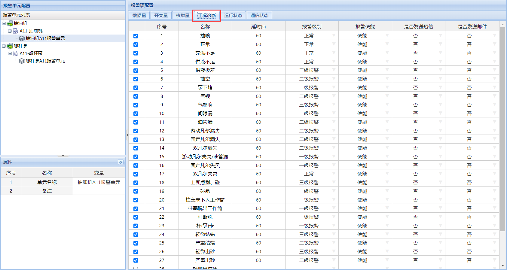

图2-75工况诊断报警项配置

5、运行状态报警项配置

勾选单元包含的运行状态报警项，并设置

延时：延时时间内不重复报警和推送；

报警级别：正常、一级报警、二级报警、三级报警（一级为最紧急严重）；

报警使能：使能或者失效（失效则一律不报警）；

是否发送短信：报警发生时是否向用户发送短信；

是否发送右键：报警发生时是否向用户发送邮件；

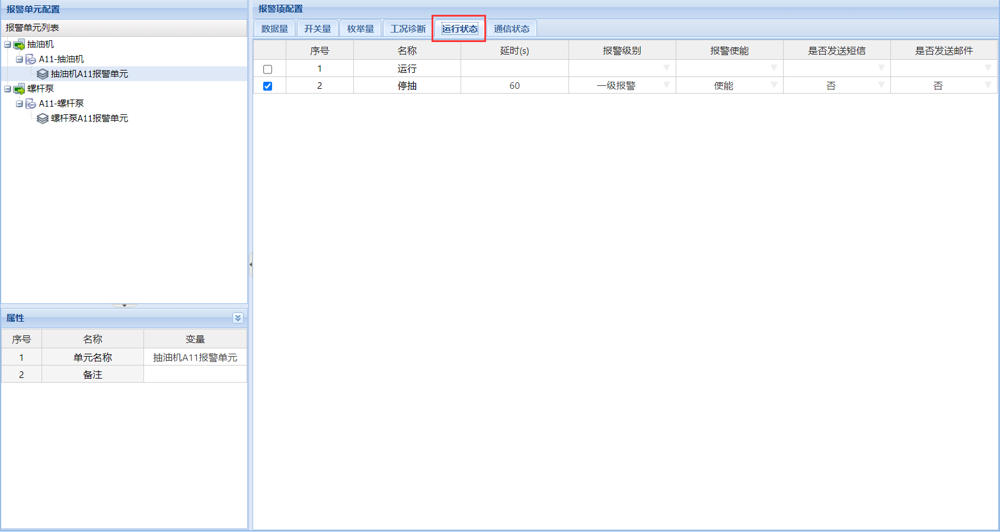

图2-76运行状态报警项配置

6、通信状态报警项配置

勾选单元包含的通信状态报警项，并设置

延时：延时时间内不重复报警和推送；

报警级别：正常、一级报警、二级报警、三级报警（一级为最紧急严重）；

报警使能：使能或者失效（失效则一律不报警）；

是否发送短信：报警发生时是否向用户发送短信；

是否发送右键：报警发生时是否向用户发送邮件；

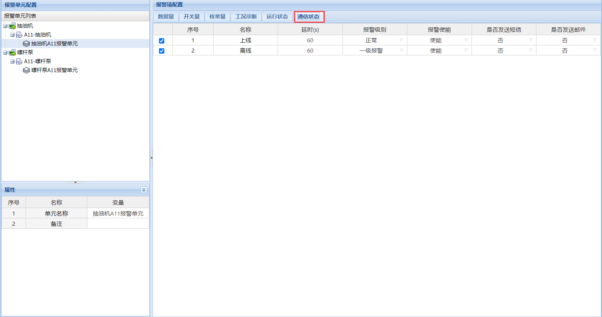

图2-77通信状态报警项配置

#### <h4>2.8.4.4 报警颜色配置</h4>

点击“报警颜色配置”按钮，对通信状态、运行状态以及各级别报警的颜色进行配置。

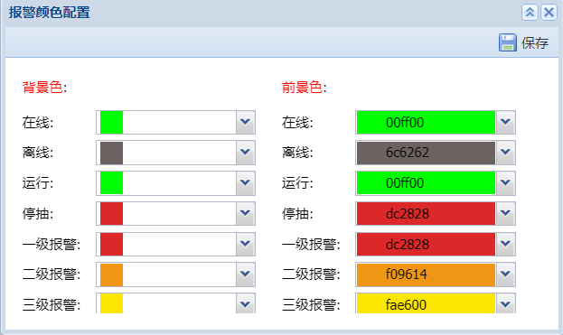

图2-78通信状态报警项配置

通信状态颜色：在线状态和离线状态报警颜色配置，生效范围：

1）实时监控模块：设备概览表中通信状态列；

2）实时监控模块：通信状态统计饼图颜色(在线、离线所设前景色)；

3）历史查询模块：设备列表和历史数据表中通信状态列；

4）历史查询模块：通信状态统计饼图颜色(在线、离线所设前景色)。

运行状态颜色：运行状态和停抽状态报警颜色配置，生效范围：

1）实时监控模块：设备概览表中运行状态列；

2）实时监控模块：运行状态统计饼图颜色(在线、离线所设前景色)；

3）历史查询模块：设备列表和历史数据表中运行状态列；

4）历史查询模块：运行状态统计饼图颜色(在线、离线所设前景色)。

报警等级颜色：数据报警等级颜色配置，生效范围：

1）实时监控模块：设备概览表和实时数据表中采集数据报警颜色；

2）历史查询模块：历史数据表和详细数据表中采集数据报警颜色。

### <h3>2.8.5 实例配置-采控实例</h3>

在采控单元中配置完采控单元后（确定采控项和地址配置），还需配置采控实例（读写以及解析时具体的协议），实例和设备直接关联。

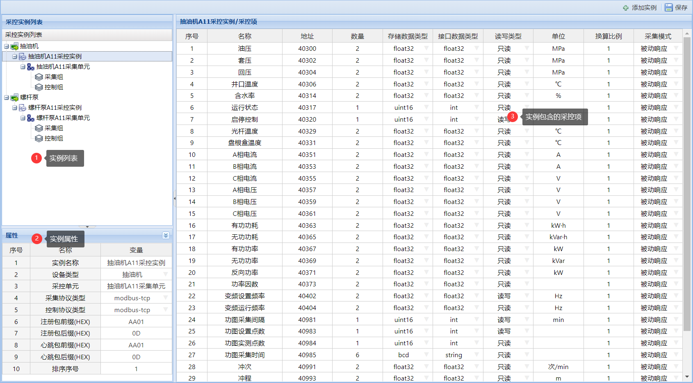

图2-79采控实例配置

#### <h4>2.8.5.1 实例列表</h4>

第一层节点：设备类型，抽油机设备或螺杆泵设备

第二层节点：采控实例；

第三层节点：采控实例配置的采控单元；

第四层节点：采控实例配置的采控单元下的采控组；

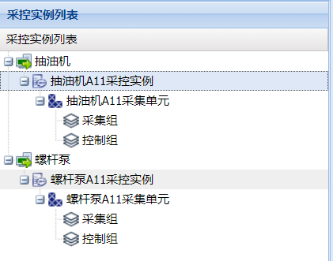

图2-80采控实例列表

#### <h4>2.8.5.2 实例属性</h4>

树形列表中所选采控实例的属性，可在此处进行查看和修改。

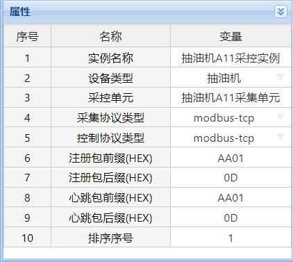

图2-81采控实例属性窗口

#### <h4>2.8.5.3 创建和删除实例</h4>

1、创建实例

点击“添加实例”按钮，进行创建。

设备类型：抽油机设备或者螺杆泵设备

实例名称：实例名称，同一设备类型下不能创建同名实例；

采控单元：在下拉框中选择对应的采控单元；

采集协议类型：数据采集及解析具体协议，目前支持private-kd93（科台斯）、private-lq1000（灵旗）、modbus-tcp、modbus-rtu四种协议；

控制协议类型：设备控制具体协议，目前支持modbus-tcp、modbus-rtu两种协议；

注册包前缀：注册包设备上线时发送的信息，如没有则不填写；

注册包后缀：如没有则不填写；

心跳包前缀：用于判断设备连接状态，如没有则不填写；

心跳包后缀：如没有则不填写；

排序：实例排序序号，对应树形列表中实例显示顺序。

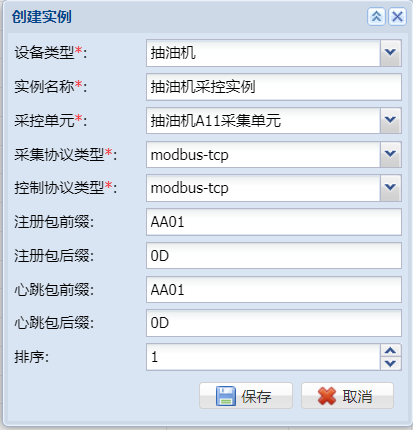

图2-82创建采控实例

2、删除实例

在左侧树形菜单中选中要删除的实例，右键→删除采控实例。

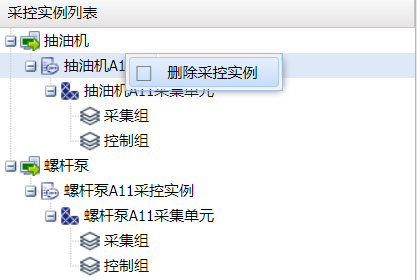

图2-83删除采控实例

### <h3>2.8.6 实例配置-显示实例</h3>

在显示单元中配置完显示单元后，还需配置显示实例。

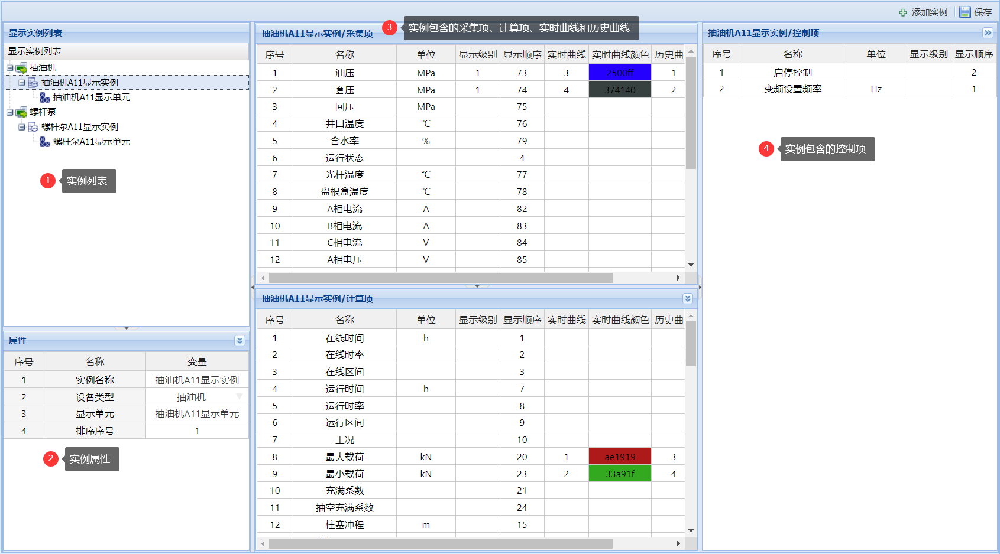

图2-84显示实例配置

#### <h4>2.8.6.1 实例列表</h4>

第一层节点：设备类型，抽油机设备或螺杆泵设备

第二层节点：显示实例；

第三层节点：显示实例配置的显示单元；

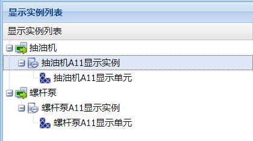

图2-85显示实例列表

#### <h4>2.8.6.2 实例属性</h4>

树形列表中所选显示实例的属性，可在此处进行查看和修改。

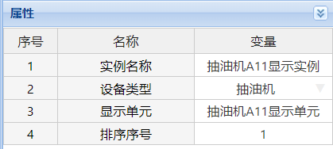

图2-86显示实例属性窗口

#### <h4>2.8.6.3 创建和删除实例</h4>

1、创建实例

点击“添加实例”按钮，进行创建。

设备类型：抽油机设备或者螺杆泵设备

实例名称：实例名称，同一设备类型下不能创建同名实例；

报警单元：在下拉框中选择对应的显示单元；

排序：实例排序序号，对应树形列表中实例显示顺序。

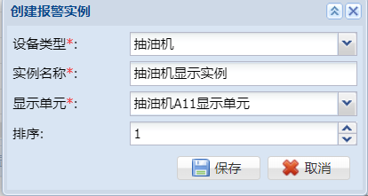

图2-87创建显示实例

2、删除实例

在左侧树形菜单中选中要删除的实例，右键→删除实例。

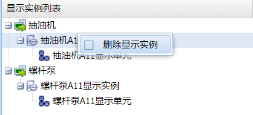

图2-88删除显示实例

### <h3>2.8.7 实例配置-报警实例</h3>

在报警单元中配置完报警单元后，还需配置报警实例。

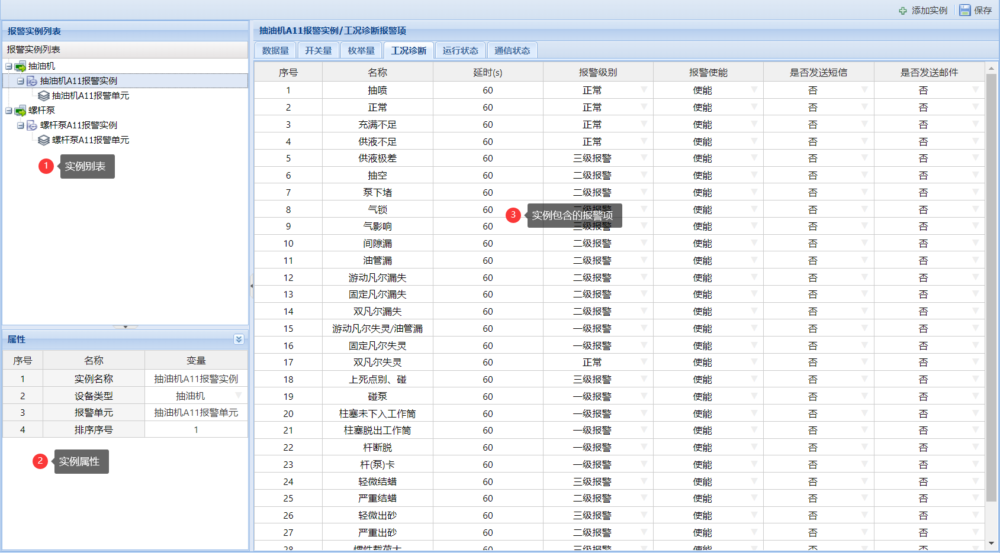

图2-89报警实例配置

#### <h4>2.8.7.1 实例列表</h4>

第一层节点：设备类型，抽油机设备或螺杆泵设备

第二层节点：报警实例；

第三层节点：报警实例配置的报警单元；

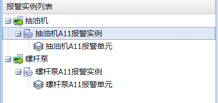

图2-90报警实例列表

#### <h4>2.8.7.2 实例属性</h4>

树形列表中所选报警实例的属性，可在此处进行查看和修改。

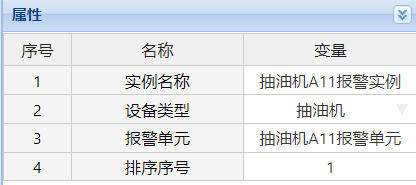

图2-91报警实例属性窗口

#### <h4>2.8.7.3 创建和删除实例</h4>

1、创建实例

点击“添加实例”按钮，进行创建。

设备类型：抽油机设备或者螺杆泵设备

实例名称：实例名称，同一设备类型下不能创建同名实例；

报警单元：在下拉框中选择对应的报警单元；

排序：实例排序序号，对应树形列表中实例显示顺序。

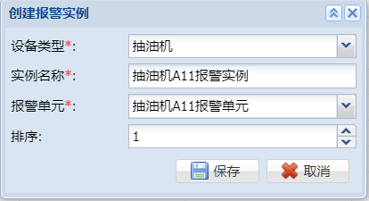

图2-92创建报警实例

2、删除实例

在左侧树形菜单中选中要删除的实例，右键→删除报警实例。

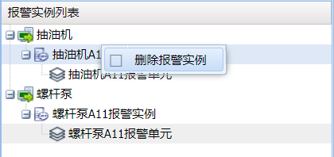

图2-93删除报警实例

### <h3>2.8.8 实例配置-短信实例</h3>

配置短信设备实例

实例名称：实例名称

采集协议类型：采集协议类型

控制协议类性：控制协议类性

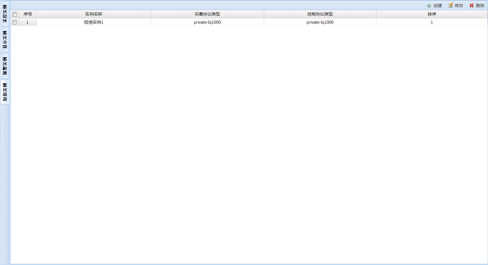

图2-94短信实例

## <h2>2.9 权限管理</h2>

系统部署完成后需要新建单位、用户并划分权限。

### <h3>2.9.1 组织用户</h3>

单位组织以及用户维护，用户列表中带\*的用户为当前登录用户。只能查看当前登录用户自己以及角色等级小于自己的其他用户。

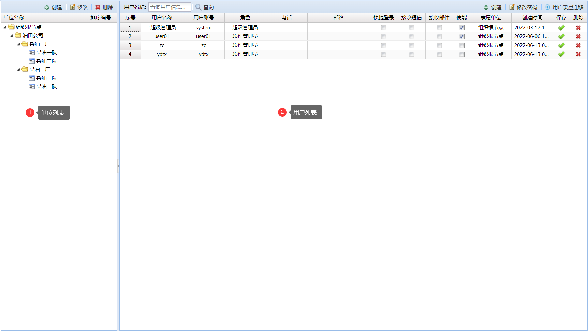

图2-95组织用户

#### <h4>2.9.1.1 单位创建</h4>

（1）点击单位窗口中“创建”按钮，弹出单位创建窗口。

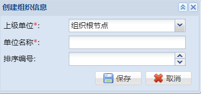

图2-96单位管理-单位创建

上级单位：默认为单位列表中选中的单位，没有选中则为列表中第一条记录；

单位名称：输入单位名称；

排序编号：单位显示顺序。

填写完成后，点击“保存”按钮，完成创建。

注意：同一父节点下，不能创建同名单位

#### <h4>2.9.1.2 单位修改</h4>

选中要修改的组织，点击“修改”按钮（或者双击）打开修改窗口，编辑相应内容后，点击“修改”按钮，完成操作。

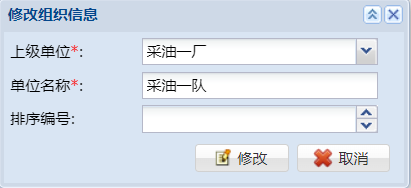

图2-97单位管理-单位修改

#### <h4>2.9.1.3 单位删除</h4>

选中要删除的单位，点击“删除”按钮进行删除操作，不能删除当前登录用户所属组织。

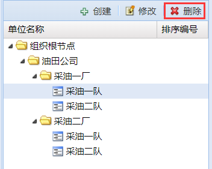

图2-98单位管理-单位删除

#### <h4>2.9.1.4 用户创建</h4>

点击用户窗口中的“创建”按钮，将在单位列表中选中的单位下创建新用户。

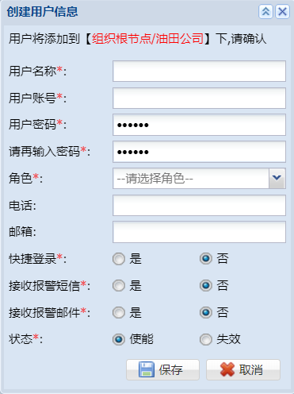

图2-99用户创建

用户名称、用户账号：按实际填写；

用户密码：默认为123456

角色：选择要授予的角色，则该用户获得所授予的角色具备的权限(只能授予其他用户小于当前登录用户角色等级的角色，如没有则需先创建角色)；

用户电话：用于接收报警短信；

内部邮箱：用于接收报警邮件(用户创建后，会向该邮箱发送用户信息邮件)；

快捷登录：在登录界面是否可以免密登录，一般用于数据查询人员；

接收报警短信：是否接收设备报警短信；

接收报警邮件：是否接收设备报警邮件；

状态：设为失效后，则该用户不能登录系统。

#### <h4>2.9.1.5 用户修改</h4>

在用户列表中，双击单元格进入编辑状态，修改用户信息，点击相应行的“保存”按钮，完成修改，并向该用户输入的邮箱发送邮件。不能修改当前登录用户的账号、角色和使能状态。

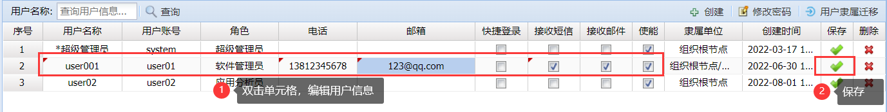

图2-100用户修改

#### <h4>2.9.1.6 用户删除</h4>

点击用户列表中“删除”按钮进行删除操作，不能删除当前登录用户。

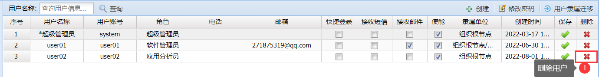

图2-101用户删除

#### <h4>2.9.1.7 修改密码</h4>

选中要修改密码的用户，点击“修改密码”按钮，录入新密码，点击“修改”。

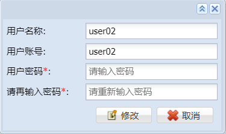

图2-101修改用户密码

#### <h4>2.9.1.8 用户隶属迁移</h4>

将用户迁移到其他单位下

点击“用户隶属迁移按钮”，在弹出的窗口中，选中要迁移的用户以及目的单位，单击“迁移”按钮，完成操作。

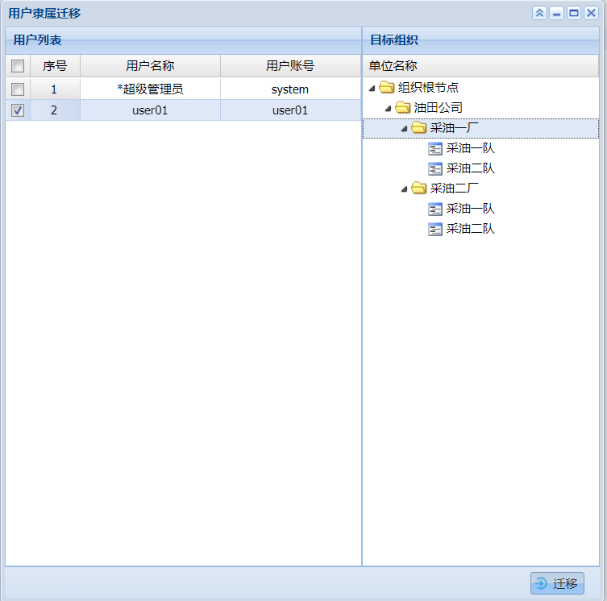

图2-102用户隶属迁移

### <h3>2.9.2 角色管理</h3>

只能查看和修改等级小于当前登录用户角色等级的角色，带\*的角色为登录用户所属角色。

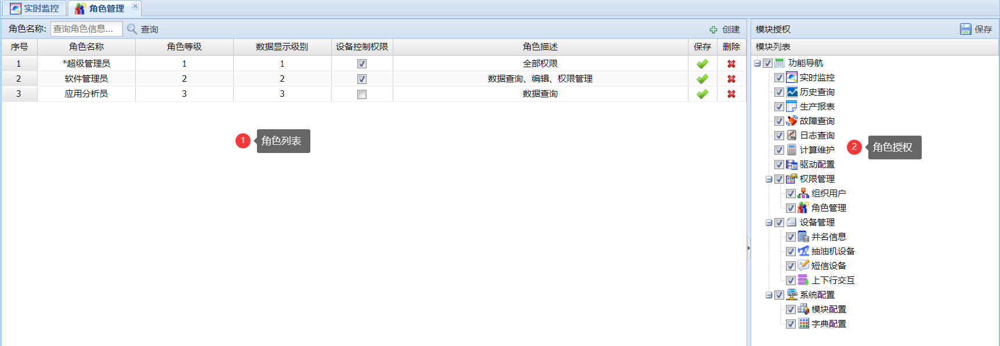

图2-103角色管理

#### <h4>2.9.2.1 角色创建</h4>

点击“创建”按钮，创建角色

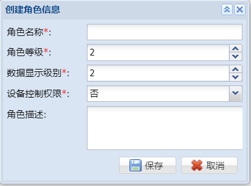

图2-104角色管理-角色创建

角色名称：角色名称；

角色登录：等级小于当前登录用户角色等级的角色(数字越大代表等级越小)；

数据显示级别：等级小于当前登录用户数据显示级别(数字越大代表等级越小)；；

设备控制权限：角色是否具有设备控制权限；

角色描述：角色信息描述；

#### <h4>2.9.2.2 角色修改</h4>

选中要修改的角色，点击“修改”按钮（或者双击角色）打开修改窗口，编辑相应内容后，点击“修改”按钮，完成操作。不能修改当前登录用户所属角色。

图2-105角色管理-角色修改

#### <h4>2.9.2.3 角色删除</h4>

点击角色列表中“删除”按钮，删除所在行角色，不能删除当前登录用户所属角色。

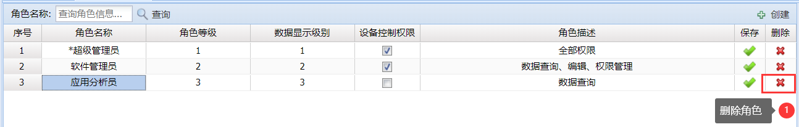

图2-106角色管理-角色删除

#### <h4>2.9.2.4 角色授权</h4>

选中要授权的角色，在右侧模块表中勾选要授予给角色的模块，点击“保存”。不能修改当前登录用户所属角色的权限。

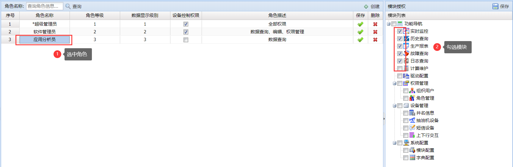

图2-107角色管理-角色授权

## <h2>2.10 设备管理</h2>

#### <h4>2.10.1 井名信息</h4>

抽油机和螺杆泵设备维护。相比于螺杆泵设备，抽油机多了抽油机性的选择和平衡块信息的配置，其他操作基本相同。

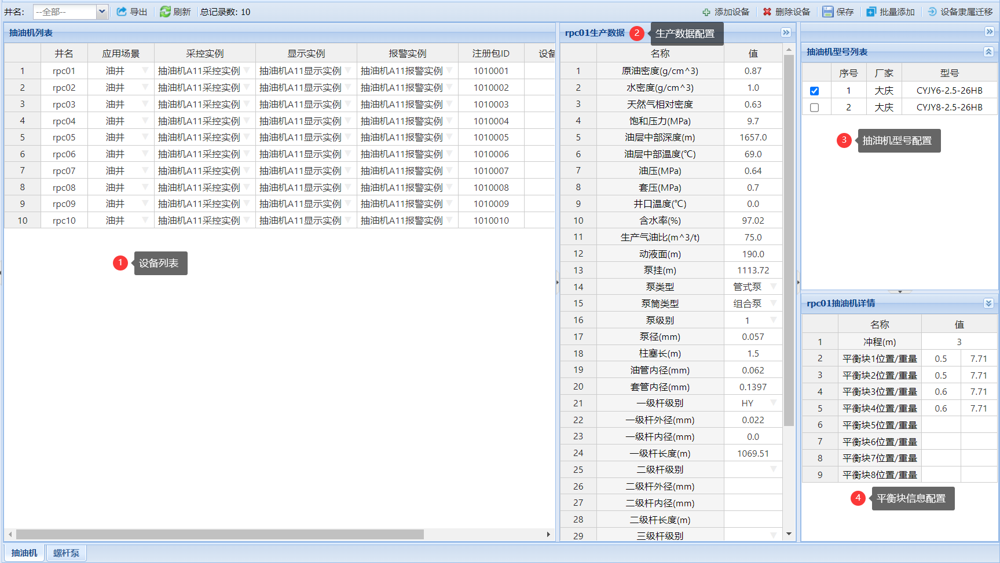

图2-108井名信息

#### <h4>2.10.1.1 设备查看及修改</h4>

1、在设备列表处进行设备主要信息查看和修改：

井名：井名；

应用场景：煤层气井或者油井；

采控实例：对应驱动配置/实例配置/采控实例中配置的实例；

显示实例：对应驱动配置/实例配置/显示实例中配置的实例；

报警实例：对应驱动配置/实例配置/报警实例中配置的实例；

注册包ID：上位机通过注册包ID和设备从地址区分设备；

设备从地址：上位机通过注册包ID和设备从地址区分设备；

状态：设为失效后，将不再采集该设备的数据；

排序编号：设备显示顺序。

2、生产配置：录入设备生产数据；

特别说明：净毛比与净毛值

净毛比与净毛值用于标定产量，标定方式为：y=ax+b，a-净毛比 b-净毛值 x-标定前产量
y-标定后产量，净毛比默认为1，净毛值默认为0，则不进行标定。

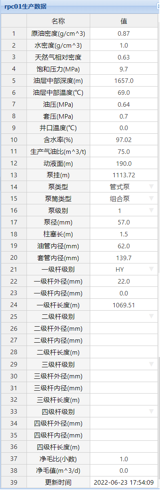

图2-109井名信息-生产数据配置

3、抽油机型号配置：抽油机设备机型配置，螺杆泵设备无。

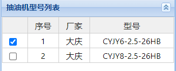

图2-110抽油机设备管理

4、抽油机平衡块信息配置：抽油机设备机型配置，螺杆泵设备无。

图2-111抽油机设备管理

#### <h4>2.10.1.2 添加设备</h4>

点击“添加设备”按钮，将在选中的单位下添加设备，如没有选中单位，则在第一个单位下添加，同一单位下不能添加同名设备。

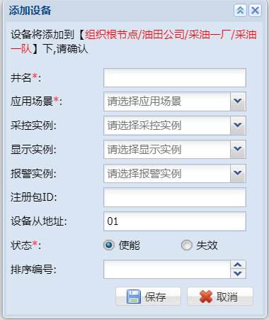

图2-112添加抽油机设备

井名：同一单位下不能添加同名设备；

应用场景：煤层气井或油井；

采控实例：对应驱动配置/实例配置/采控实例中配置的实例；

显示实例：对应驱动配置/实例配置/显示实例中配置的实例；

报警实例：对应驱动配置/实例配置/报警实例中配置的实例；

注册包ID：上位机通过注册包ID和设备从地址区分设备；

设备从地址：上位机通过注册包ID和设备从地址区分设备；

状态：设为失效后，将不再采集该设备的数据；

排序编号：设备显示顺序；

#### <h4>2.10.1.3 删除设备</h4>

在设备列表中选中删除的设备，点击“删除设备”按钮，进行删除操作。

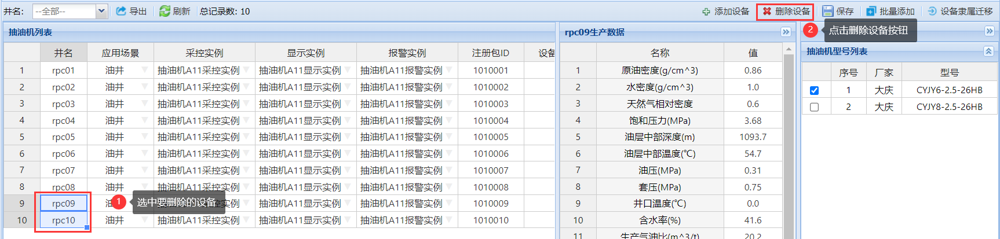

图2-113删除抽油机设备

#### <h4>2.10.1.4 批量添加</h4>

点击“批量添加”按钮，在所选单位下进行设备批量添加。在弹出的窗口中编辑添加的设备信息（可在excel中编辑好，粘贴到表格中），点击“保存”按钮进行保存。校验无问题的数据直接保存，有问题的数据返回并显示异常数据处理窗口，在窗口中进行数据修改二次保存，或者放弃。无异常数据直接保存成功。

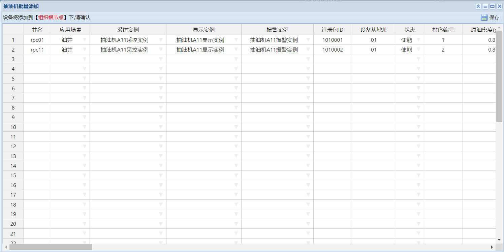

图2-114批量添加抽油机设备

保存后，如果有校验不通过的数据，会显示异常数据处理窗口。异常数据分为冲突数据(注册包ID、设备从地址和已有设备冲突)和已有数据（同一单位下已存在同名设备）。

冲突数据修改注册包ID和设备从地址，直到无冲突时才可保存成功。

已有数据继续保存的话，覆盖同名设备的信息，不会添加设备。

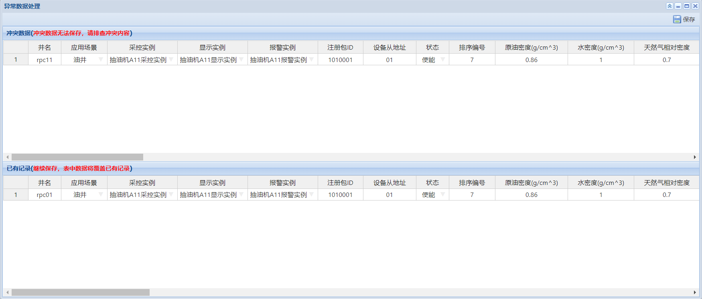

图2-115批量添加抽油机设备-异常数据处理

### <h3>2.10.2 抽油机信息</h3>

抽油机型号维护。

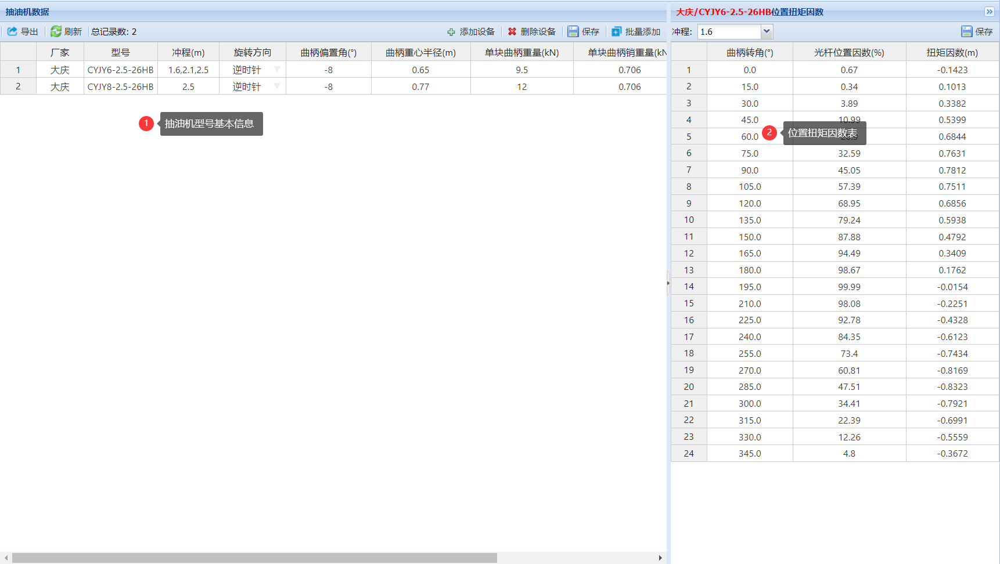

图2-116抽油机信息管理

#### <h4>2.10.2.1 修改设备</h4>

在表中修改设备信息或者在位置扭矩因数，点击“保存”按钮。

注意：不同冲程对应的位置扭矩因数需分别录入。

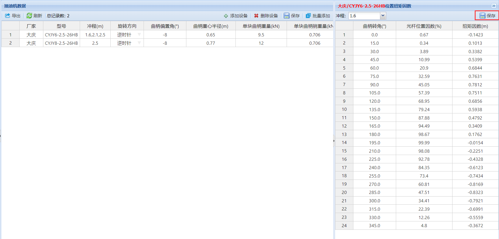

图2-117抽油机型号修改

#### <h4>2.10.2.2 添加设备</h4>

点击“添加设备”按钮，打开添加窗口，不能添加设备厂家、型号全部相同的设备。

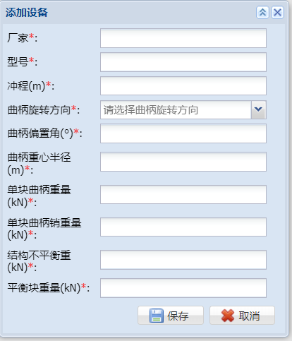

图2-118添加抽油机型号

#### <h4>2.10.2.3 删除设备</h4>

在设备列表中选中删除的设备，点击“删除设备”按钮，进行删除操作。

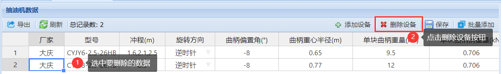

图2-119删除抽油机型号

#### <h4>2.10.2.4 批量添加</h4>

点击“批量添加”按钮，进行设备批量添加。在弹出的窗口中编辑添加的设备信息（可在excel中编辑好，粘贴到表格中），点击“保存”按钮进行保存。校验无问题的数据直接保存，有问题的数据返回并显示异常数据处理窗口，在窗口中进行数据修改二次保存，或者放弃。无异常数据直接保存成功。

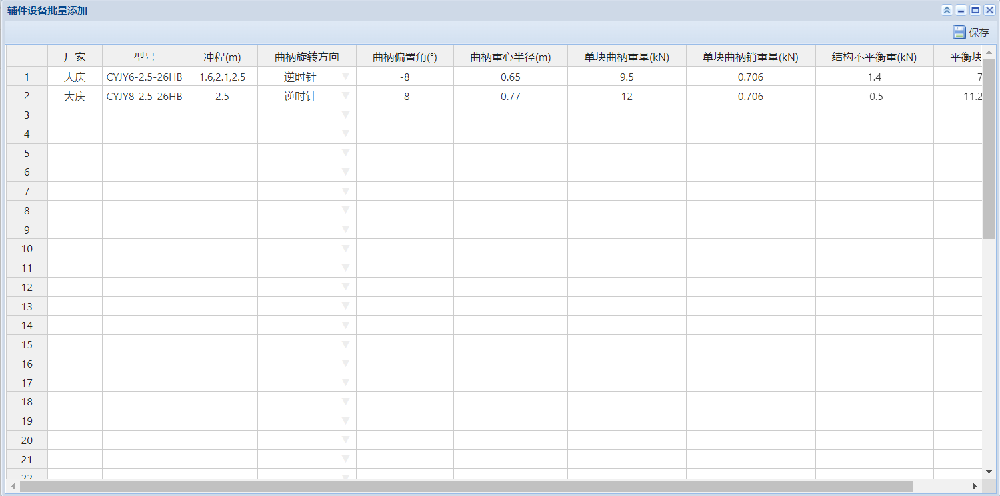

图2-120批量添加抽油机型号

保存后，如果有校验不通过的数据，会显示异常数据处理窗口。异常数据主要为已有数据（设备名称、类型、规格型号相同）。

已有数据继续保存的话，覆盖同名设备的信息，不会添加设备。

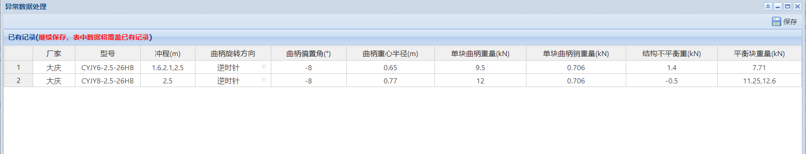

图2-121批量添加辅件设备-异常数据处理

### <h3>2.10.3 短信设备</h3>

#### <h4>2.10.3.1 修改设备</h4>

在表中修改设备信息后，点击“保存按钮”。

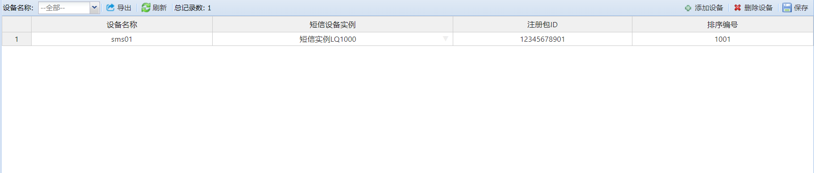

图2-122短信设备管理

#### <h4>2.10.3.2 添加设备</h4>

点击“添加设备”按钮，打开添加窗口，不能添加同名设备。

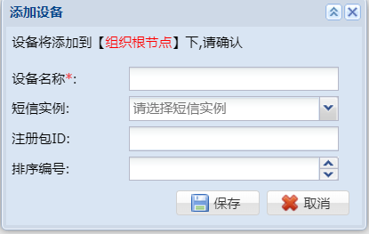

图2-123添加短信设备

#### <h4>2.10.3.3 删除设备</h4>

在设备列表中选中删除的设备，点击“删除设备”按钮，进行删除操作。

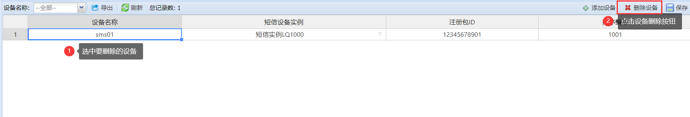

图2-124删除螺杆泵设备

## <h2>2.11 系统配置</h2>

### <h3>2.11.1 模块配置</h3>

配置模块信息。可修改模块名称、模块简介、模块顺序，其他内容不要改动。

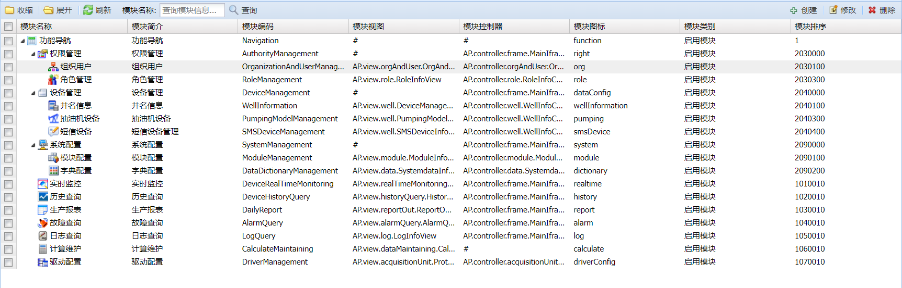

图2-125模块配置

### <h3>2.11.2 字典配置</h3>

对各模块显示的字段进行管理，主要修改字段名称、显示顺序、是否启用等。如“抽油机设备实时概览”（即实时监控模块中抽油机设备概览表）中显示哪些内容，可点击对应字典项，并在里面进行勾选。字典模块代码和字段代码不要修改。

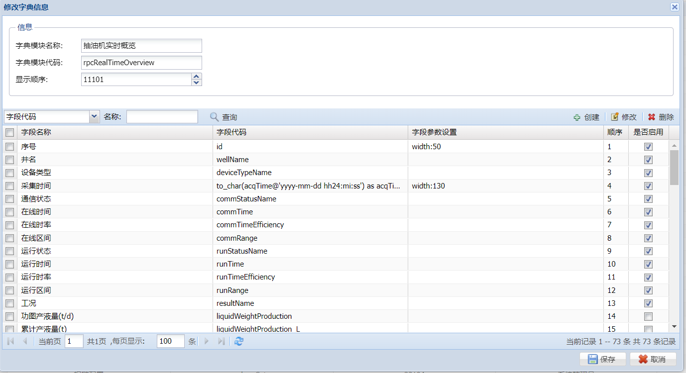

图2-126字典配置

双击某一项，进行该数据项修改，字段代码和数据库字段对应，不要修改：

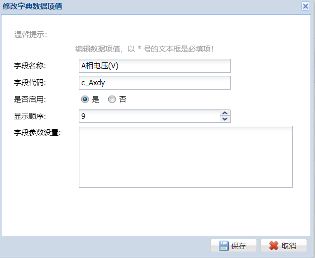

图2-127字典数据项配置
