

**敏捷生产**

**AgileProduction**

**用 户 手 册**

**目 录**

[第1章 系统介绍](#第一章系统介绍)

>   [1.1 环境要求](#1.1环境要求)

>   [1.2 驱动说明](#1.2驱动说明)

>   [1.3 系统安装](#1.3系统安装)

>   [1.4 系统配置](#1.4系统配置)

>   [1.5 系统使用说明](#1.5系统使用说明)

>   [1.6 工况说明](#1.6工况说明)

>   [1.6.1 功图工况](#1.6.1功图工况)

>   [1.6.2 平衡工况](#1.6.2平衡工况)

[第2章 应用介绍](#第2章应用介绍)

>   [2.1 页面布局](#2.1页面布局)

>   [2.2 实时评价](#2.2实时评价)

>   [2.2.1 统计](#2.2.1统计)

>   [2.2.2 目标井](#2.2.2目标井)

>   [2.2.3 单井数据](#2.2.3单井数据)

>   [2.3 全天评价](#2.3全天评价)

>   [2.4 生产报表](#2.4生产报表)

>   [2.5 图形查询](#2.5图形查询)

>   [2.6 权限管理](#2.6权限管理)

>   [2.6.1 单位管理](#2.6.1单位管理)

>   [2.6.2 用户管理](#2.6.2用户管理)

>   [2.7 数据配置](#2.7数据配置)

>   [2.7.1 数据源](#2.7.1数据源)

>   [2.7.2 井名信息](#2.7.2井名信息)

>   [2.7.3 生产数据](#2.7.3生产数据)

>   [2.7.4 抽油机信息](#2.7.4抽油机信息)

>   [2.7.5 井身轨迹](#2.7.5井身轨迹)

>   [2.8 数据维护](#2.8数据维护)

>   [2.8.1 计算维护](#2.8.1计算维护)

>   [2.9 系统配置](#2.9系统配置)

>   [2.9.1 字典配置](#2.9.1字典配置)

>   [2.9.2 统计配置](#2.9.2统计配置)

>   [2.9.3 报警配置](#2.9.3报警配置)

## <h1>第一章 系统介绍</h1>  

## <h2>1.1 环境要求</h2>

CPU：2核及以上

内存：8G及以上

硬盘：500G及以上

操作系统：建议Windows server 2012 64位及以上

数据库：Oracle 11g及以上

JDK：8.0及以上

Tomcat：9.0及以上

## <h2>1.2 驱动说明</h2>

1、中石油标准

支持中石油A11标准及拓展驱动

2、中石化标准

支持中石化“四化”标准及拓展驱动

3、其他Modbus、MQTT、kafka协议模式

## <h2>1.3 系统安装</h2>

1、正确安装并配置jdk(版本:1.8)、tomcat(版本:9.0)、oracle(版本:11g及以上)

2、创建数据库

1）打开《数据库创建》文件夹下《createDB》文件夹，打开1、createSpaceAndUser.sql文件，按照实际情况修改其中表空间及用户的信息

2）编辑批处理文件autorun.bat中的数据库连接信息，保存关闭后，双击执行，执行完毕后按任意键退出，数据库创建完毕

3、软件部署：将加密U盘插入服务器，运行SDK程序(可在U盘中直接运行，也可拷贝到其他目录运行)；将《软件》文件夹下的文件解压并复制到tomcat安装目录\\webapps文件夹下。

##  <h2>1.4 系统配置</h2>

同步修改tomcat安装目录\\webapps\\ap\\WEB-INF\\config\\config.yml和tomcat安装目录\\webapps\\ap\\WEB-INF\\classes\\config\\config.yml文件，配置项如下：

1、软件访问路径配置

>   

2、数据库连接配置

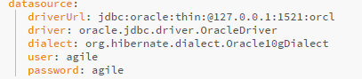

一般只需修改IP、用户名、密码即可。

注意：对于oracle12c及以上版本，端口后是”/”，而不是”:”，如jdbc:oracle:thin:@127.0.0.1:1521/orcl

3、软件名称及简介配置

4、SDK计算URL配置，只需修改IP即可

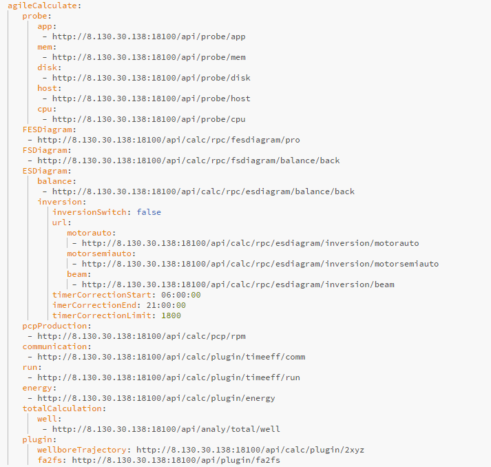

5、产量单位配置

软件支持两种产量单位显示：t/d以及m\^3/d，可根据配置切换

0-t/d；1-m\^3/d。

## <h2>1.5 系统使用说明</h2>

系统部署完成后需要根据使用者实际情况进行数据配置，流程如下：

1、输入默认的系统管理员账号进入系统；

2、“单位管理”模块创建单位信息，**详情查看2.6.1节；**

3、“用户管理”模块为单位创建用户，**详情查看2.6.2节；**

4、“数据源”模块配置对接数据库的信息，**详情查看2.7.1节；**；

5、“井名信息”模块录入井信息，**详情查看2.7.2节；**；

6、“生产数据”模块录入井的油层数据、泵数据、杆柱组合数据等；**详情查看2.7.3节；**

7、“井身轨迹”模块录入井的测量深度、井斜角、方位角，**详情查看2.7.4节；**录入完成后，可在界面中画出井身轨迹图；

8、“抽油机数据”模块录入抽油机相关数据，**详情查看2.7.5节；**录入完成后，可进行曲柄平衡计算，得到曲柄平衡块移动距离、目前/预期扭矩曲线（包括载荷扭矩、平衡块扭矩、曲柄扭矩、净扭矩）及抽油机运动特性曲线（包括位移、速度）；

## <h2>1.5 系统使用说明</h2>

### <h3>1.6.1 功图工况</h3>

表1-1 功图工况表

| **序号** | **代码** | **名称**         | **优化建议**       |
|----------|----------|------------------|--------------------|
| 1        | 1201     | 抽喷             |                    |
| 2        | 1202     | 正常             |                    |
| 3        | 1203     | 充满不足         |                    |
| 4        | 1204     | 供液不足         | 间抽或降低冲次     |
| 5        | 1205     | 供液极差         | 间抽或降低冲次     |
| 6        | 1206     | 抽空             | 间抽或降低冲次     |
| 7        | 1207     | 泵下堵           | 洗井或加药         |
| 8        | 1208     | 气锁             | 合理控制气体       |
| 9        | 1209     | 气影响           | 合理控制气体       |
| 10       | 1210     | 间隙漏           | 检泵               |
| 11       | 1211     | 油管漏           | 油管打压试验       |
| 12       | 1212     | 游动凡尔漏失     | 洗井、碰泵或检泵   |
| 13       | 1213     | 固定凡尔漏失     | 洗井、碰泵或检泵   |
| 14       | 1214     | 双凡尔漏失       | 洗井、碰泵或检泵   |
| 15       | 1215     | 游动凡尔失灵     | 洗井、碰泵或检泵   |
| 16       | 1216     | 固定凡尔失灵     | 洗井、碰泵或检泵   |
| 17       | 1217     | 双凡尔失灵       | 洗井、碰泵或检泵   |
| 18       | 1218     | 上死点别、碰     | 校正井口设备       |
| 19       | 1219     | 碰泵             | 上提（增大）防冲距 |
| 20       | 1220     | 柱塞未下入工作筒 | 下放（缩小）防冲距 |
| 21       | 1221     | 柱塞脱出工作筒   | 下放（缩小）防冲距 |
| 22       | 1222     | 杆断脱           | 替换抽油杆         |
| 23       | 1223     | 杆（泵）卡       | 洗井或检泵         |
| 24       | 1224     | 轻微结蜡         | 洗井或加药         |
| 25       | 1225     | 严重结蜡         | 洗井或加药         |
| 26       | 1226     | 轻微出砂         | 防砂               |
| 27       | 1227     | 严重出砂         | 防砂               |
| 28       | 1230     | 惯性载荷大       | 降低冲次           |
| 29       | 1231     | 应力超标         | 优化抽油杆柱组合   |
| 30       | 1232     | 采集异常         | 检查采集仪表       |
| 31       | 1302     | 停抽             |                    |

### <h3>1.6.2 平衡工况</h3>

范围可根据实际情况在“统计配置”模块电流平衡、功率平衡选项中修改。

表1-2 平衡工况表

| **序号** | **范围**          | **名称**   |
|----------|-------------------|------------|
| 1        | 平衡度＜70%       | 严重欠平衡 |
| 2        | 70%＜平衡度≤85%   | 欠平衡     |
| 3        | 85%＜平衡度≤100%  | 平衡       |
| 4        | 100%＜平衡度≤115% | 过平衡     |
| 5        | 平衡度\>115%      | 严重过平衡 |

# <h1>第2章 应用介绍</h1> 

浏览器要求：建议谷歌浏览器、360浏览器极速模式、IE9以上版本。

## <h2>2.1 页面布局</h2>

1、banner区：包括修改密码、退出、帮助及全屏按钮；

2、功能导航区：系统各主功能模块；

3、组织导航区：用户组织结构；

4、统计区：井信息统计图表；

5、单井数据区：单井分析、采集及控制详细信息。

通过点击界面中缝位置的图标或可实现界面伸缩。

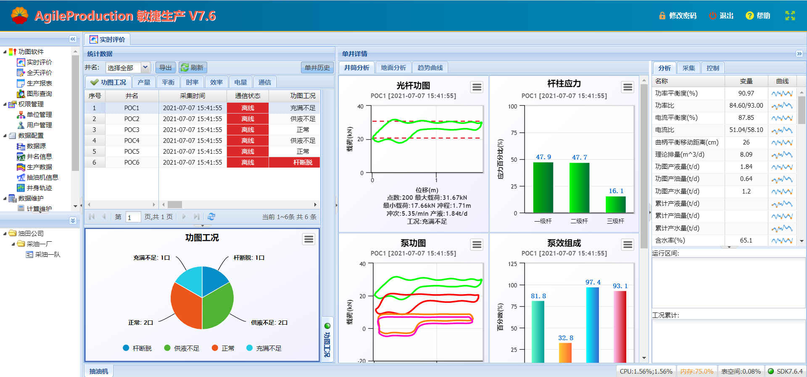

图2-1 界面概览

## <h2>2.2 实时评价</h2>

根据油井的动静态数据对单井进行实时评价，**有新数据时（包括功图和离散数据），界面自动刷新。**

### <h3>2.2.1 统计</h3>

统计主标签：包括功图工况、产量、平衡、时率、效率、电量、通信；

统计子标签：各主标签包含的子项，如平衡包括电流平衡和功率平衡；

统计表/图：根据选择的各主标签、子标签显示相关统计信息。

资源监测：动态监测服务器的资源使用率、数据库表空间使用率、SDK运行状态与版本信息。

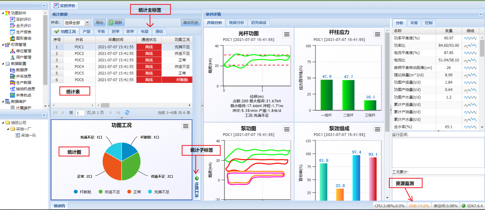

图2-2 统计

### <h3>2.2.2 目标井</h3>

如需查看某一类目标价的具体信息时，如充满不足，

1、点击统计图中“充满不足”对应的饼或标签；

2、统计表中显示该组织下的所有“充满不足”井；

3、右侧单井详情中显示该井的详细信息；

4、选择某井所在行后点击“单井历史”或“双击该行”可查看该井的历史信息。

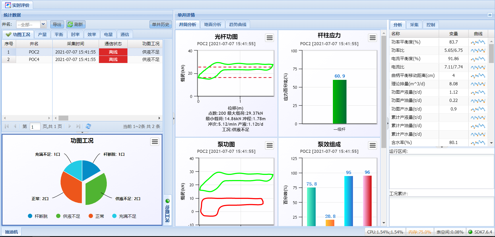

图2-3 目标井

### <h3>2.2.3 单井数据</h3>

包括图形及分析、采集、控制。

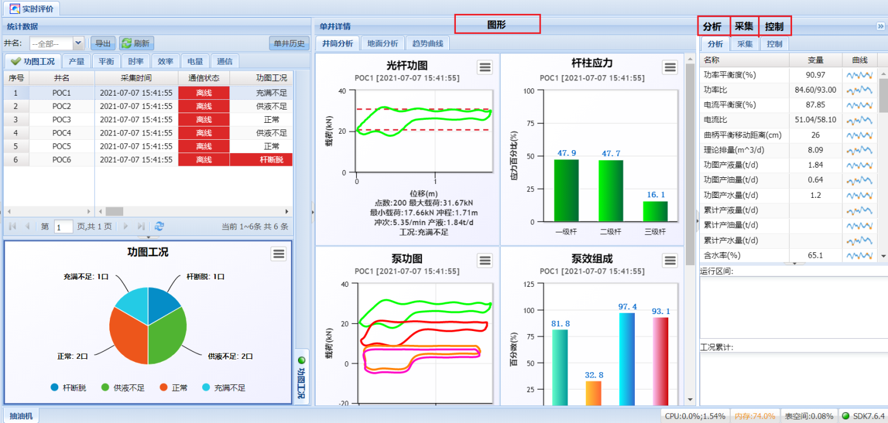

图2-4 单井数据

#### <h4>2.2.3.1 图形</h4>

**1、井筒分析**

**（1）光杆功图**

1.  功图采集时间：例如2021-07-07 15:41:55

2.  上理论载荷线：上理论载荷=活塞以上液柱载荷+抽油杆在液柱中的载荷

3.  下理论载荷线：下理论载荷=抽油杆在液柱中的载荷

4.  最大载荷：功图最大载荷

5.  最小载荷：功图最小载荷

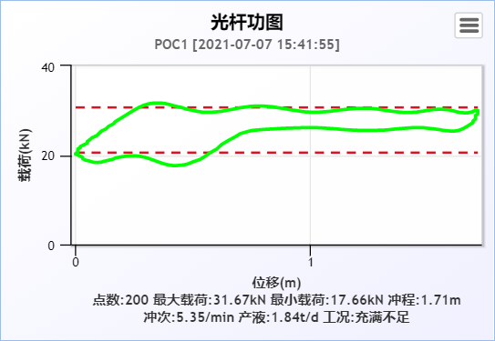

图2-5 地面功图

**（2）泵功图**

从上至下依次为：

1.  地面功图

2.  二级杆顶端功图

3.  泵功图

图2-6 泵功图

**（3）杆柱应力**

根据杆柱组合，分析各级杆柱的受力情况，判断杆柱组合是否合理。

1.  一级杆顶端应力百分比

2.  二级杆顶端应力百分比

3.  

图2-7 杆柱应力

**（4）泵效组成**

泵的实际排量与泵的理论排量之比的百分数称为泵效。

—冲程损失对泵效的影响；

—泵的充满程度，功图计算分析求得；

—液体的漏失系数，考虑泵工作时液体漏失的影响；

—体积变化的影响，通过计算泵条件下的液体体积系数求得；

图2-8 泵效组成

**（5）物性剖面**

压力、就地气液比沿井筒的变化。

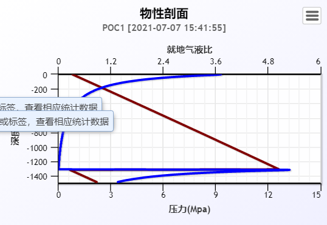

图2-9 物性剖面

**（6）井身轨迹**

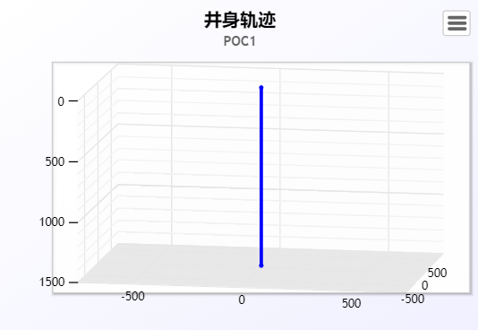

图2-10 井身轨迹

**2、地面分析**

**（1）电功图**

电功图是电的有功功率图，功率平衡度计算：

图2-11 电功图

**（2）电流图**

电流平衡度计算：

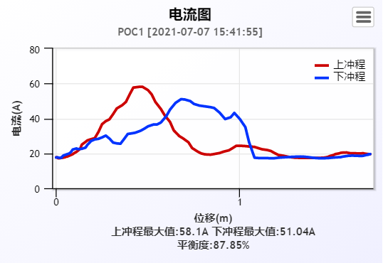

图2-12 电流图

**（3）电流曲线**

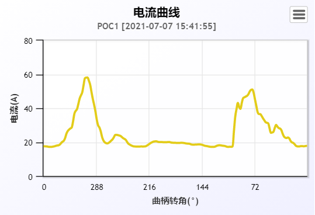

图2-13 电流曲线

**（4）目前扭矩曲线**

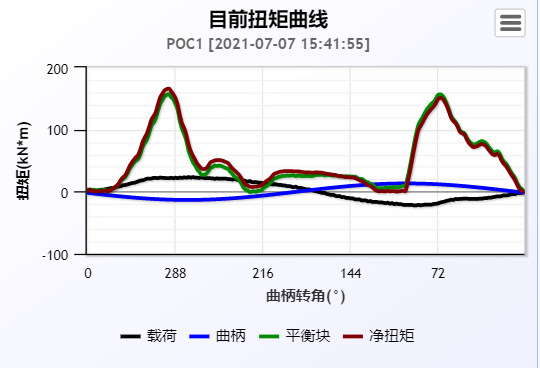

图2-14 目前扭矩曲线

**（5）预期扭矩曲线**

根据曲柄平衡移动距离推导出的调整后的预期扭矩曲线。

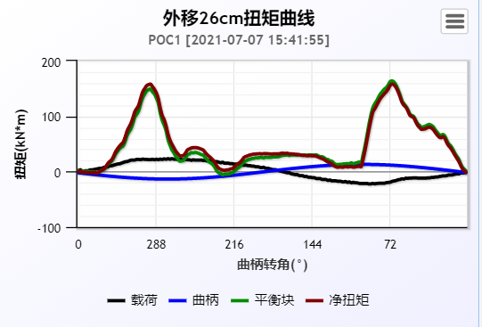

图2-15 预期扭矩曲线

**（6）运动特性曲线**

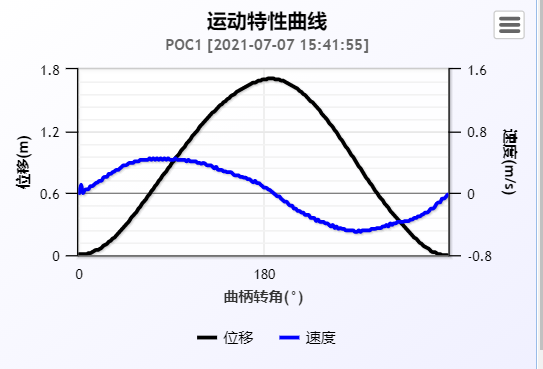

图2-16 运动特性曲线

**3、趋势曲线**

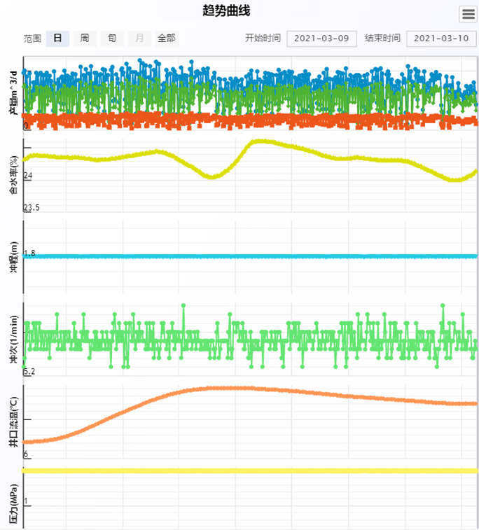

图2-17 趋势曲线

#### <h4>2.2.3.2 分析</h4>

显示计算分析结果参数及曲线，包括产量构成、泵效、系统效率、泵出入口参数等。点击每行后的“曲线图标”可查看各参数的趋势曲线。

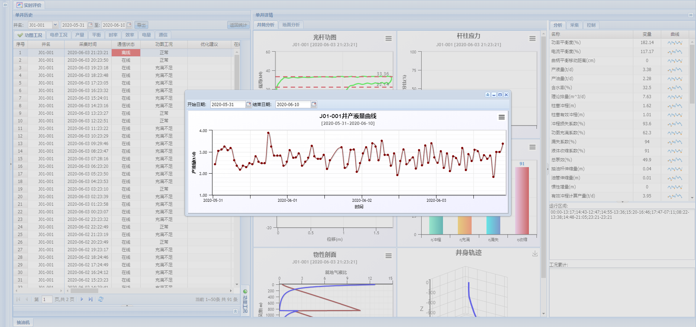

图2-18 分析

#### <h4>2.2.3.3 采集</h4>

显示传感器采集数据，包括通信状态、运行状态、油（套）压、频率等。点击每行后的“曲线图标”可查看各参数的趋势曲线。

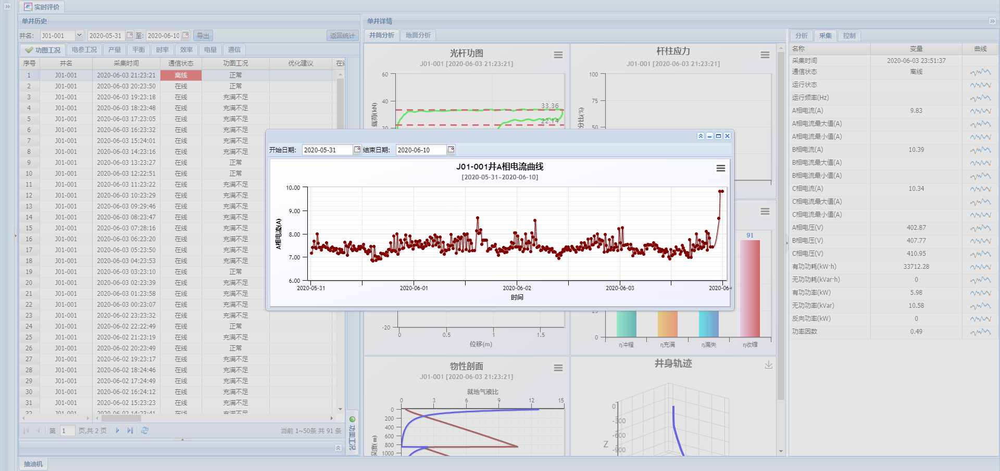

图2-1 采9集

#### <h4>2.2.3.4 控制</h4>

对于自动化井，可进行启停抽控制、频率控制等。

## <h2>2.3 全天评价</h2>

根据全天的采集数据与分析结果对单井进行全天评价。

运行时率、通信时率：累计值，当天的运行时率=运行时间/当天时间；

以前的运行时率=运行时间/24小时；

移动距离、效率、液量、平衡度等：根据运行时率计算的加权平均值；

日用电量：累计值。

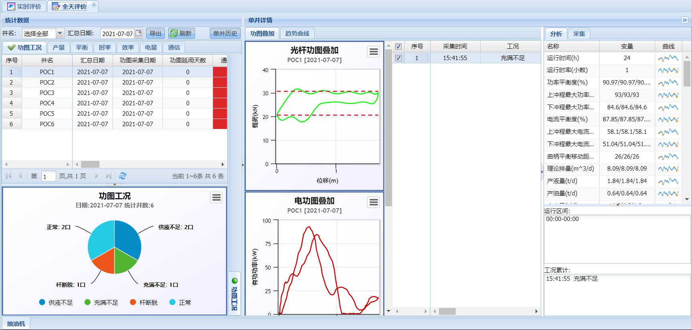

图2-120 全天评价

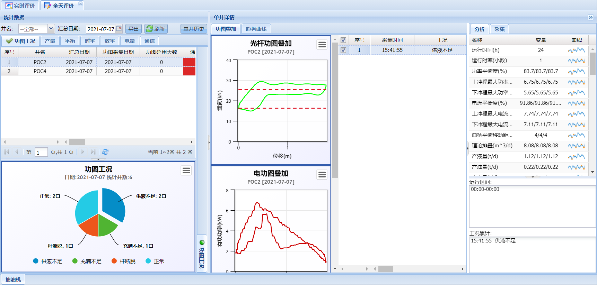

图2-21 目标井

## <h2>2.4 生产报表</h2>

各参数计算方法与全天评价模块相同。

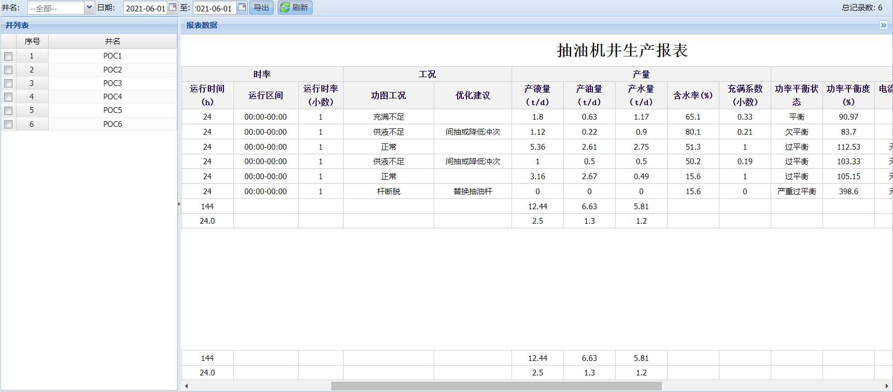

图2-22 生产报表

## <h2>2.5 图形查询</h2>

默认显示所有井最新地面功图，选择某一口井显示该井历史地面功图。

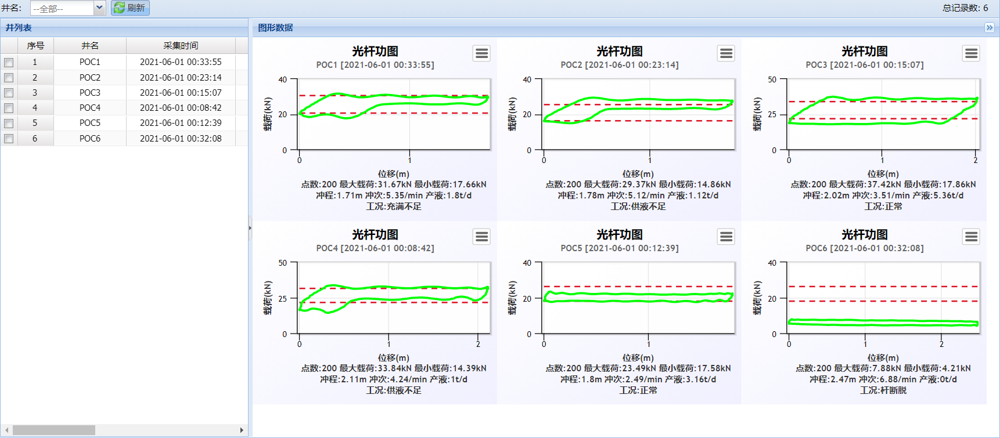

图2-23 图形查询

## <h2>2.6 权限管理</h2>

系统部署完成后需要新建单位、用户并划分权限。

### <h3>2.6.1 单位管理</h3>

1、使用系统管理员账号登录系统。

2、进入**单位管理**模块创建单位组织。如模拟油田公司—模拟采油厂—四矿、五矿。

（1）点击“创建”按钮，创建模拟油田公司。

上级单位：由于模拟油田公司为根节点，**上级单位不选择**；

单位类别：按实际选择，局级；

单位名称：油田公司；

单位编码、单位级别：确定上级单位、单位类别后自动生成；

单位说明：可不填写。

填写完成后，点击“保存”按钮，完成创建。

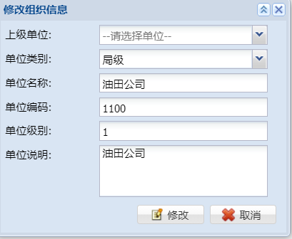

图2-24 单位创建

（2）点击“创建”按钮，创建模拟采油厂。

上级单位：已创建根节点，选择模拟油田公司；

单位类别：按实际选择，厂级；

单位名称：采油一厂；

填写完成后，点击“保存”按钮，完成创建。

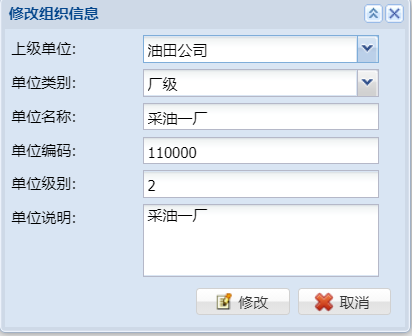

图2-25 单位创建

（3）依次完成各级单位组织创建。

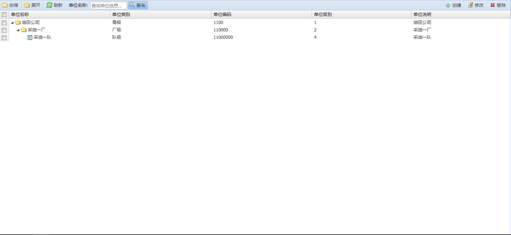

图2-26 单位创建

### <h3>2.6.2 用户管理</h3>

进入**用户管理**模块，为不同的单位组织创建用户。点击“创建”按钮，创建新用户。填写完成后，点击“保存”按钮，完成创建。

单位名称：选择已创建的单位组织，确定组织的用户登录后，只能看到该组织及该组织的下属单位对应的信息；

角色：包括功图软件管理员、功图软件分析员；管理员可以对油井数据进行修改维护；分析员只能查看相关诊断分析结果；

用户名称、用户账号、用户密码：按实际填写；

用户电话、内部邮箱：可不填写；

快捷登录：在登录界面是否可以免密登录，一般用于数据查询人员。

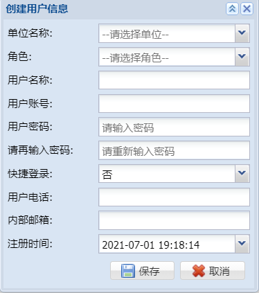

图2-27 用户创建

## <h2>2.7 数据配置</h2>

包括数据源、井名信息、生产数据、井身轨迹、抽油机信息数据配置维护。

### <h3>2.7.1 数据源</h3>

当需要和其他数据库对接读取数据时，如功图数据等，需在该模块配置目标数据库的信息，如目标数据库的IP、端口、数据库实例名称、用户名、密码，功图数据表的名称及字段等信息。

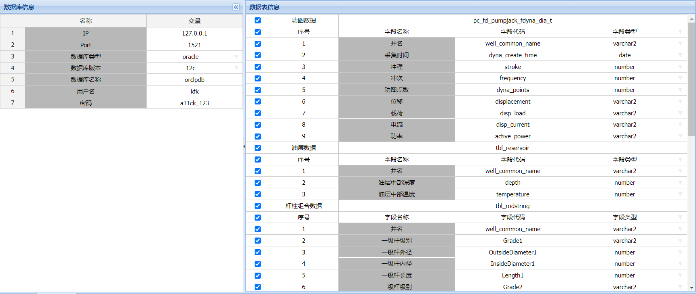

图2-28 数据源配置

### <h3>2.7.2 井名信息</h3>

#### <h4>2.7.2.1 数据收集</h4>

1、单位名称：井所属单位，单位管理中创建的单位名称；

2、区块名称：井所属区块，**可不填写**；

3、井名；

4、举升类型：抽油机、螺杆泵；

5、采集单元：数据库直读方式不需填写；

6、注册包ID：设备上传的注册包中携带的注册信息，数据库直读方式不需填写；

7、设备从地址：数据库直读方式不需填写；

8、视频路径：监控视频的URL路径；

9、排序编号：井名在系统显示时的排序。

#### <h4>2.7.2.2 数据录入</h4>

可在Excel中编辑好后粘贴至井名信息模块中。

注意：

1、录入时需要先在组织导航中选择录入井所在的组织，如四矿；否则会提示“**请先选择组织节点**”；

2、复制时序号列不要复制。

#### <h4>2.7.2.3 修改井名</h4>

在列表中修改井名，完成后点击“修改井名”按钮。

注意：

1、不要先删除需修改井，再重新录入新井，会导致历史数据丢失；

2、修改完成后，点击“修改井名”按钮，不要点击“保存”按钮。

#### <h4>2.7.2.4 删除数据</h4>

选中一行或多行，右键，选择删除行，然后点击“保存”按钮。

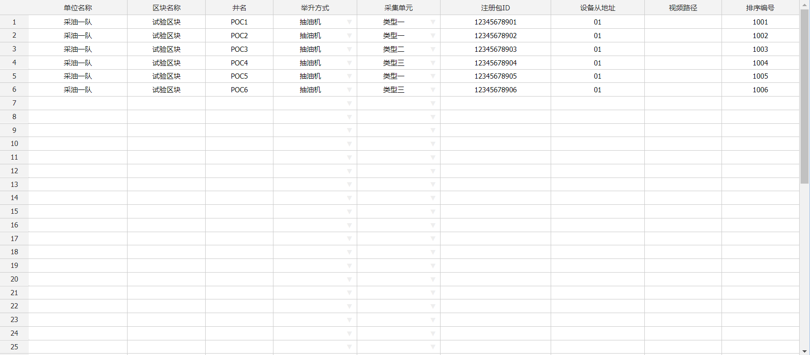

图2-29 井名信息

### <h3>2.7.3 生产数据</h3>

#### <h4>2.7.3.1 数据收集</h4>

1、生产时间：无时率采集数据井填写，全天工作填写24，间抽按间抽时间填写，停井填写0；

2、原油密度、水密度、天然气相对密度、饱和压力、油层中部深度、油层中部温度如果没有单井数据，可以参考所在区块数据；

3、油压：未测油压数据可填写回压；

4、泵级别：泵筒类型为组合泵筒时，泵级别可为1、2、3；泵筒类型为整筒时，泵级别可为1、2、3、4、5；

5、泵径：国标：28、32、38、44、51、57、63、70、83、95；API标准：26.99、31.8、38.1、44.5、45.2、50.8、57.2、63.5、69.9、82.6、95.3

6、套管内径：生产套管内径；

7、抽油杆数据

（1）抽油杆数据不包括光杆、泵上拉杆；

（2）对于某些井最后一级会有几十米的加重杆，例如外径28mm，长度50m，需收集；

（3）从井口到泵依次为一级杆、二级杆......，理论上除加重杆，外径逐级减小；

（4）杆的总长度应接近泵挂深度；

（5）杆级别，包括A，B，C，D，K，KD，HL，HY；

（6）杆内径，空心杆填写；

8、锚定状态：包括锚定和未锚定；抽油机井默认是未锚定；

9、净毛比：用于产量标定，净毛比=实际产量/软件计算产量，默认为1，一般情况不修改。对于计产疑难井（油管漏、游动凡尔漏失、固定凡尔漏失），产量差距较大时，可以调整。例如：实际产量：20t/d，软件计算产量：40t/d，净毛比可设置在0.5左右。

10、时率来源：井的时率数据来源，根据实际填写：

软件计算：由软件根据采集的运行状态自动计算；

采控直读：从设备中直接读取每天的实时累计运行时间；

数据库直读：从对接的数据库中读取

人工录入：无以上三种来源时，需人工录入，及以该模块录入的生产时间为准。

#### <h4>2.7.3.2 数据录入</h4>

收集完成后，复制粘贴到模块中。粘贴时无需按照模块列表中井顺序调整Excel表，直接粘贴保存即可。

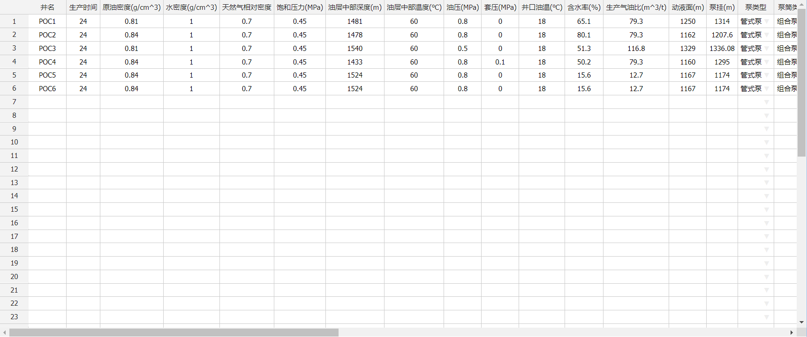

图2-30 生产数据

### <h3>2.7.4 抽油机信息</h3>

在计算**曲柄平衡移动距离**，给出优化建议时，需要用到部分抽油机数据，该部分数据可在对应厂家、型号的抽油机说明书中找到。

#### <h4>2.7.4.1 数据收集</h4>

1、抽油机厂家、型号：查看对应抽油机的铭牌；

2、冲程：曲柄销孔对应的抽油机冲程，**可不填写**；

3、旋转方向：查看抽油机说明书；

4、曲柄偏置角：也称平衡相位角，一般对于异相型有偏置角，部分说明书中没有正负说明，应为负度数；

5、曲柄重心半径：查看抽油机说明书；

6、单块曲柄重量：说明书中的曲柄重为两个曲柄的总重，单块曲柄重量为曲柄的总重/2；

7、单块曲柄销重量：查看抽油机说明书；

7、结构不平衡重：查看抽油机说明书；

8、平衡块位置：目前抽油机平衡块位置，需要现场确认，**可不填写**；

9、平衡块重量：确认抽油机平衡块数量，按抽油机说明书中对应的重量填写；

10、抽油机位置扭矩因数：**可不填写**。

**注意：**

1、平衡块位置和重量填写规则（例如4块平衡块）：

平衡块位置（各位置之间“英文逗号”隔开）：0.5,1.2,0.5,1.5

平衡块重量（各重量之间“英文逗号”隔开）：13.9,11.16,13.9,11.16

2、如果抽油机说明书中数据单位与表格需求的不一致，要进行转换，比如1kg=0.0098kN。

####<h4>2.7.4.2 数据录入</h4>

收集完成后，复制粘贴到模块中。

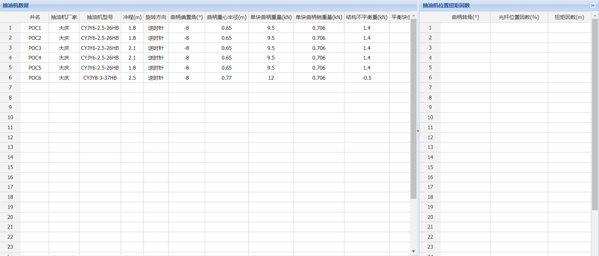

图2-31 抽油机信息

### <h3>2.7.5井身轨迹</h3>

选择对应井名，将收集完成的井身轨迹数据（测量深度、井斜角、方位角）录入到“井身轨迹数据”中，点击“保存”按钮完成录入。

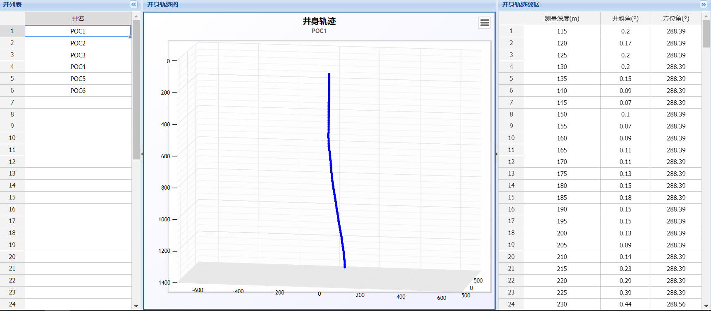

图2-32 井身轨迹

## <h2>2.8 数据维护</h2>

### <h3>2.8.1 计算维护</h3>

#### <h4>2.7.6.1 使用场景</h4>

计算维护模块主要应用场景包括：

>   1、针对系统部署初期或现场设备安装初期，各井的生产数据并未收集或收集的不完整，在进行功图诊断及产量计算时采用了模拟数据，待后续生产数据收集完整后，需要对历史数据进行重新计算。

>   2、生产数据收集的部分数据有误，更正后需要重新计算。

>   3、在使用过程中，现场作业后并未及时更新生产数据。

>   4、其他需要对历史数据进行重新计算的情况。

注意：

在“生产数据”模块中修改参数只会应用到之后的计算分析中，对已经计算完成的历史数据并不生效。如果想要对历史结果重新计算，需要在“计算维护”模块中进行。

历史结果会被重新计算的结果覆盖。

0或2为未计算，1为计算完成，-99为计算错误，请检查生产数据。

#### <h4>2.7.6.2 使用方法</h4>

对历史结果进行重新计算有两种方法，根据实际情况选择较为便捷的方法：

1、修改数据计算

选择目标井，找到需要修改的某条记录或某个时间段的多条记录，修改完生产数据后，点击“修改数据计算”按钮进行重新计算。

例如：修改POC1井，2021年7月7号全部功图采集时间的泵径数据并重新计算。

操作：井名中选择POC1或者左侧井列表选中该井，时间范围选择2021-07-07至2021-07-07，修改表中参数，点击“修改数据计算”按钮。

图2-33 修改数据计算

2、关联数据计算

利用生产数据表中的最新生产数据对某口井或所有井某个时间段内的所有历史结果进行重新计算。

（1）单井关联数据计算

例如：修改POC1井，2021年7月7日内的所有历史结果。

操作：“生产数据”模块中已录入最新生产数据，“计算维护”模块中井名选择POC1，时间范围2021-07-07至2021-07-07，点击“关联数据计算”。弹出操作确认对话框，确认无误后点击“是”。这时，POC1井2021年7月7日的所有历史数据将按最新的生产数据进行重新计算。

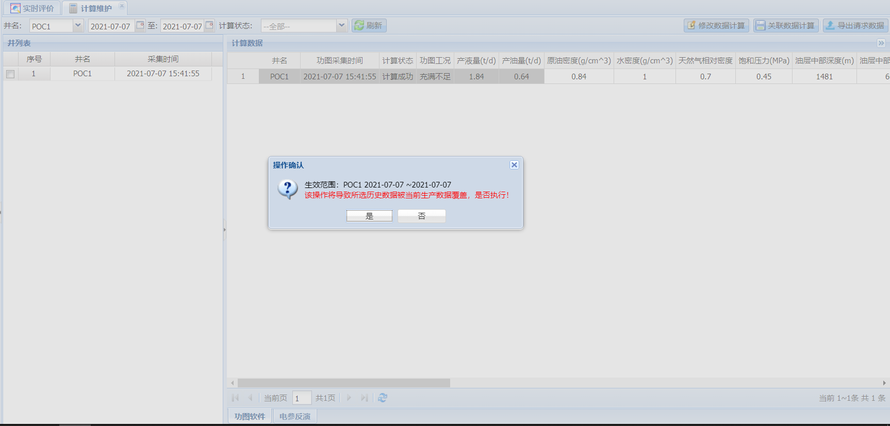

图2-34 单井关联数据计算

（2）所有井关联数据计算

例如：单位组织下所有井，2021年7月7日至2021年7月7日内的所有历史结果。

操作：“生产数据”模块中已录入最新生产数据，“计算维护”模块中井名不选择或选择全部，时间范围2021-07-07至2021-07-07，点击“关联数据计算”。弹出操作确认对话框，确认无误后点击“是”。这时，所有井2021年7月7日至2021年7月7日的所有历史数据将按最新的生产数据进行重新计算。

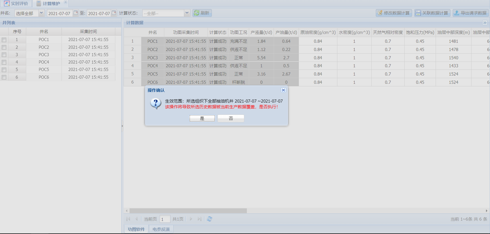

图2-35 所有井关联数据计算

## <h2>2.9 系统配置</h2>

### <h3>2.9.1 字典配置</h3>

对各模块显示的字段进行管理，主要修改字段名称、显示顺序、是否显示等。如“抽油机实时评价\_功图工况”（即实时评价模块中功图工况子标签中的列表项）中是否显示在线时率或运行时率相关参数，可点击对应字典项，并在里面进行勾选。

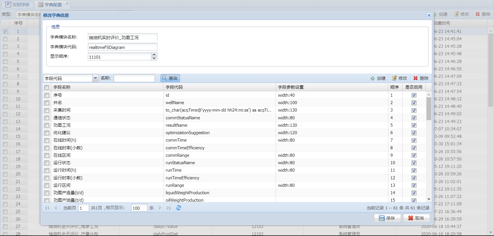

图2-36 字典配置

### <h3>2.9.2 统计配置</h3>

配置各项参数的统计级别。如设置功率平衡度的界限范围值，可点击对应相，并在里面进行修改。

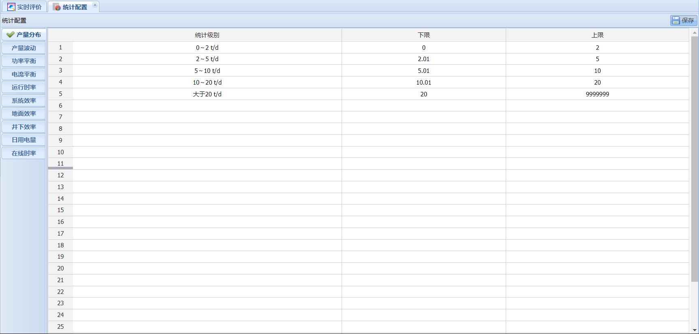

图2-37 统计配置

### <h3>2.9.3 报警配置</h3>

设置报警级别、开关、颜色等。

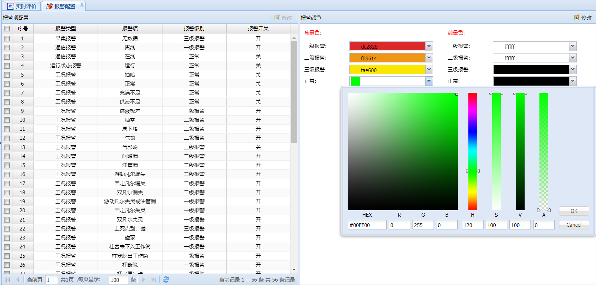

图2-38 报警配置
